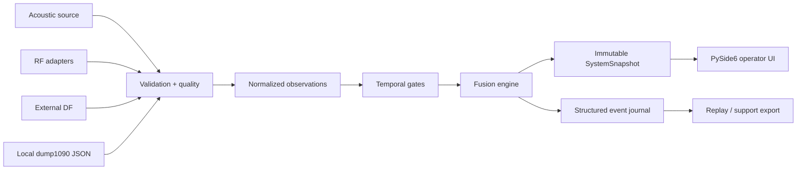
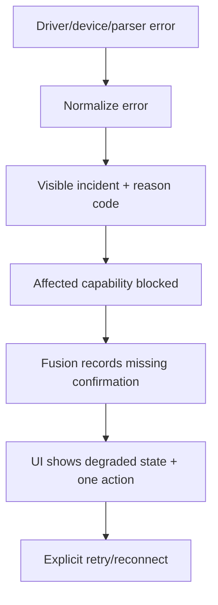

# ALGA VECTOR 0.6 — гражданская платформа раннего предупреждения

Дата решения: 2026-07-26  
Статус документа: архитектура и границы первого запускаемого инкремента  
Подпись продукта: **Разработал: Буйвол и Задира**

## Этап A. Позиционирование

ALGA VECTOR — Windows-first offline-first платформа наблюдения за неизвестными
воздушными, акустическими и RF-эпизодами рядом с гражданским объектом. Она
объединяет измерения нескольких пассивных источников, показывает оператору
происхождение данных и формирует предупреждение только после временной проверки.

Продукт не выполняет подавление, наведение или национальную/военную атрибуцию.
ADS-B используется как контекст кооперативных гражданских бортов, а не как IFF
или полная картина воздушного пространства.

Короткая формула:

> Пассивное наблюдение. Проверяемая корреляция. Своевременное предупреждение.

### Варианты названия

1. ALGA VECTOR
2. ALGA VIGIL
3. ALGA HORIZON
4. ALGA AWARE
5. ALGA FUSION
6. ALGA OBSERVER
7. ALGA SCOPE
8. ALGA PULSE
9. ALGA PERIMETER
10. ALGA SIGNAL

Финалисты: **ALGA VECTOR**, **ALGA VIGIL**, **ALGA HORIZON**.

Итог: **ALGA VECTOR — гражданская мультисенсорная система раннего
предупреждения**. Название сохраняет уже реализованный продукт и не ограничивает
его одним физическим сенсором.

## Этап B. Architecture Decision Record

### ADR-060-001: production-minded modular monolith

Решение: оставить единый устанавливаемый Windows-продукт, но разделить код по
контрактам источников, анализа, корреляции, хранения и UI.

Причины:

- один локальный процесс поставки и единая версия конфигурации;
- предсказуемая упаковка PyInstaller;
- отсутствие обязательной сетевой инфраструктуры;
- сквозная типизация и тестирование;
- возможность вынести тяжёлый адаптер в отдельный worker без изменения
  доменных контрактов;
- простой offline deployment для предприятия.

Микросервисы на первом этапе отклонены: они добавляют сертификаты, оркестрацию,
сетевые отказы и эксплуатационную стоимость, но не улучшают качество измерений.

### ADR-060-002: Python 3.12 + PySide6

Python остаётся ядром обработки благодаря NumPy, существующим SDR-библиотекам,
быстрому созданию валидаторов и тестов. PySide6 обеспечивает нативное Windows
окно, контролируемый lifecycle, accessibility и упаковку без браузерного
runtime.

Qt WebEngine не входит в foundation. Ситуационный экран должен сначала
использовать существующий raster MBTiles/Qt painter path. WebEngine допустим
только после отдельного измерения размера сборки, startup time и offline
поведения.

### ADR-060-003: нормализованное наблюдение перед fusion

Каждый источник преобразует собственный формат в immutable observation:

- `RF`: измеренная спектральная активность и качество кадра;
- `ACOUSTIC`: общая форма звука и измеренные признаки;
- `DIRECTION`: внешний измеренный bearing с freshness/calibration metadata;
- `CIVIL_ADSB`: контекст публичного кооперативного вещания.

Fusion не читает драйверы напрямую. Он работает только с проверенными
наблюдениями и не может «додумывать» отсутствующие поля.

### ADR-060-004: fail-closed и graceful degradation

Отсутствие одного источника:

- не завершает приложение;
- не превращается в нулевое измерение;
- уменьшает доступные подтверждения;
- явно отображается как `unavailable/degraded`;
- оставляет остальные сенсоры рабочими.

Старые данные не считаются текущими. Demo/replay никогда не маркируются как
live.

### ADR-060-005: безопасные классы и evidence strength

Допустимые акустические классы:

- `rotor_like`;
- `engine_like`;
- `broadband_anomaly`;
- `unknown_aerial_like`;
- `ambient_noise`.

Допустимые fusion-состояния:

- `background`;
- `unconfirmed_anomaly`;
- `rf_activity`;
- `acoustic_anomaly`;
- `multi_sensor_correlated`;
- `nearby_cooperative_aircraft_context`.

Числовой score является эвристической силой признаков, а не вероятностью типа,
происхождения или намерения объекта.

### Поток данных



### Startup flow

1. Разрешить single-instance lock.
2. Найти локальные каталоги config/data.
3. Загрузить, мигрировать и строго проверить конфигурацию.
4. Открыть structured JSONL log.
5. Открыть локальный event journal.
6. Создать адаптеры, не открывая произвольные COM/USB-устройства.
7. Запустить runtime и health aggregation.
8. При первом запуске показать onboarding.
9. Создать MainWindow и начать bounded polling.
10. На shutdown остановить workers, flush журнал и закрыть устройства.

### Failure flow



Stack trace не показывается оператору. Тип исключения и безопасный технический
контекст остаются в expert log/support bundle.

### Offline flow

- конфигурация, журнал, записи и карты находятся локально;
- сетевые карты не требуются;
- ADS-B foundation читает локальный `aircraft.json`;
- потеря сети не изменяет RF/acoustic/DF обработку;
- support bundle создаётся локально и не отправляется автоматически.

### Replay flow

1. Оператор выбирает финализированную запись.
2. Reader проверяет schema, checksum и provenance.
3. Replay clock публикует события с исходными временными смещениями.
4. Runtime имеет provenance `replayed`.
5. Fusion выполняется детерминированно с зафиксированной версией алгоритма.
6. UI блокирует действия, которые могут быть приняты за live acquisition.

В первом foundation replay является следующей capability после стабильного
event schema; demo не подменяет replay.

## Этап C. UX-концепция

### Принцип

Оператор сначала видит итоговое состояние, затем доказательства и только потом
технические детали. На каждом экране различаются:

- измеренный факт;
- интерпретация;
- недостающие подтверждения;
- ограничение;
- рекомендуемое действие.

### Экранная карта

| Экран | Назначение | Foundation |
|---|---|---|
| Splash / Boot | Этапы запуска и безопасная ошибка | Реализован |
| First Run | Режим, каталог, оборудование, обучение | Реализован |
| Dashboard | Единое состояние и следующий шаг | Реализован, расширяется fusion |
| Devices | Приёмники и источник данных | Реализован |
| Spectrum / RF | Измеренный спектр и RF-события | Реализован |
| Acoustic | Признаки, класс формы, качество | Core в foundation, отдельный экран beta |
| Direction | Bearing только от валидного источника | Реализован |
| Situation | Offline map/context/replay | Capability-gated beta |
| Event Journal | История решений и доказательства | Реализован для RF, расширяется |
| Diagnostics | Health, incidents, support bundle | Реализован |
| Settings | Strict validated configuration | Реализован |
| Demo / Replay | Training и воспроизводимость | Demo реализован; replay beta |

### Guided journey

1. Запустить приложение.
2. Пройти onboarding и выбрать demo либо live.
3. На Dashboard увидеть готовность каждого сенсора.
4. Исправить только первый блокирующий prerequisite.
5. При событии открыть карточку с тремя ключевыми доказательствами.
6. Перейти в журнал за полной цепочкой.
7. Экспортировать support bundle при диагностической проблеме.

### Expert journey

Эксперт дополнительно видит source ID, timestamps, freshness, quality flags,
частотную сетку, calibration metadata, temporal lifecycle, supporting/
contradicting evidence и versioned algorithm identifiers.

### Empty/error/degraded states

- `Нет настроенного источника`: настройте конкретный источник.
- `Источник отключён`: включите его в validated settings.
- `Драйвер отсутствует`: установите драйвер; остальные возможности продолжают
  работу.
- `Данные устарели`: прежнее наблюдение не используется.
- `DF недоступен`: bearing отсутствует, сектор не рисуется.
- `ADS-B устарел`: контекст недоступен и не влияет на unknown incident.
- `Карта отсутствует`: список и timeline остаются рабочими.
- `Storage blocked`: запись отключена, live-наблюдение остаётся доступным.

### Design system

- Golos Text с кириллицей, body не меньше 12 px.
- Near-black/graphite surfaces.
- Emerald/teal: ready/active.
- Amber: progress/warning.
- Red: error/critical.
- Никаких blue-violet gradients, glow и декоративного AI-вида.
- Минимальная интерактивная высота 32 px.
- Один dominant state card; не более одного primary action в Guided.
- Footer: `Разработал: Буйвол и Задира`.

## Этап D. Файлы, контракты и схемы

### Целевая структура modular monolith

```text
src/alga_vector/
  application/          runtime orchestration
  config/               strict schema and migrations
  devices/              SDR and fake adapters
  signal_analysis/      RF detector and temporal decision
  acoustics/            PCM features and acoustic temporal assessment
  airspace/             local civilian dump1090 context
  direction/            validated bearing input
  sensor_fusion/        normalized observations and fusion FSM
  maps/                 offline MBTiles compatibility
  storage/              journal, capture and retention
  observability/        JSONL logs and health
  support/              redacted local support bundle
  ui/                   PySide6 shell, pages and widgets
tests/                  deterministic unit/integration/UI tests
packaging/              PyInstaller, version resources and build scripts
```

### Главные обязанности

- `ApplicationRuntime`: lifecycle, locks, immutable snapshots, adapters and
  graceful degradation.
- `DeviceManager`: explicit configured hardware, safe refresh/reconnect.
- `AcousticDetector`: PCM validation, measured features, temporal class.
- `CivilAirspaceService`: bounded local JSON read, TTL and malformed isolation.
- `SensorFusionEngine`: time-window correlation and evidence chain.
- `EventJournal`: durable decisions and replay metadata.
- `HealthAggregator`: readiness without hiding blocked capabilities.
- `MainWindow`: routing and non-modal alert surface.

### Конфигурация v0.6

```yaml
schema_version: 5
mode: live
profile_name: Enterprise profile 01
acoustic:
  enabled: false
  source: disabled
  source_id: microphone-01
  sample_rate_hz: 48000
  window_seconds: 1.0
airspace:
  enabled: false
  aircraft_json_path: ""
  stale_after_seconds: 5.0
fusion:
  window_seconds: 8.0
  min_consecutive_observations: 3
  hold_seconds: 4.0
```

Пустой путь или отключённая capability валидны. Неизвестные поля запрещены.

### Нормализованное observation

```json
{
  "observation_id": "obs-...",
  "sensor_kind": "acoustic",
  "source_id": "microphone-01",
  "observed_at": "2026-07-26T12:00:00Z",
  "quality": "medium",
  "strength": 0.71,
  "summary": "rotor-like acoustic form",
  "evidence": ["temporal repetition", "dominant tonal structure"],
  "limitations": ["single microphone cannot provide bearing"]
}
```

### Fusion event

```json
{
  "event_id": "fusion-...",
  "lifecycle": "candidate",
  "kind": "unconfirmed_anomaly",
  "first_seen_at": "2026-07-26T12:00:00Z",
  "last_seen_at": "2026-07-26T12:00:02Z",
  "evidence_strength": "medium",
  "supporting_observation_ids": ["obs-a", "obs-r"],
  "contradicting_evidence": [],
  "missing_confirmation": ["validated external direction"],
  "limitations": ["no platform or nationality attribution"],
  "provenance": "live",
  "algorithm_version": "fusion-1"
}
```

### Structured log schema

```json
{
  "timestamp": "2026-07-26T12:00:02.123Z",
  "level": "INFO",
  "event": "fusion.transition",
  "message_ru": "RF и акустическое изменение подтверждены во времени.",
  "runtime_mode": "live",
  "source_ids": ["rtl-01", "microphone-01"],
  "event_id": "fusion-...",
  "reason_code": "FUSION.MULTI_SENSOR_CONFIRMED"
}
```

Секреты, точные координаты и USB serial удаляются либо псевдонимизируются в
support bundle.

## Этап E. План поставки

### Foundation / MVP 0.6

- запускаемый PySide6 shell;
- Dashboard, Devices, Spectrum/RF, Direction, Events, Diagnostics, Settings;
- onboarding;
- safe/demo/live provenance;
- реальные RTL-SDR/HackRF/tinySA adapter contracts;
- deterministic fake RF/acoustic/ADS-B/DF inputs;
- acoustic feature/temporal core;
- local civilian ADS-B parser;
- fusion core и объяснимый snapshot;
- structured logs, health и support bundle;
- PyInstaller GUI/CLI build и portable ZIP.

### Beta

- выбранный Windows microphone capture backend;
- отдельный Acoustic screen и spectrogram/MFCC presentation;
- local dump1090 file watcher;
- versioned multi-sensor journal;
- replay reader и replay clock;
- offline Situation screen с capability gates;
- external Kraken adapter contract validation against permitted hardware.

### Hardening

- physical hardware matrix;
- Windows clean-VM installation test;
- microphone/USB hot-unplug;
- long-duration soak and disk pressure;
- latency/queue metrics;
- crash recovery and power-loss journal tests;
- code signing and installer;
- field validation only on permitted civilian test scenarios.

## Этап F. Первый запускаемый инкремент

Реализованный состав:

- `src/alga_vector/ui/` — PySide6 shell, Dashboard, Devices, Diagnostics,
  onboarding и маркировка Live/Safe/Demo;
- `src/alga_vector/devices/` — fake и receive-only hardware adapter contracts,
  discovery, bounded worker и reconnect;
- `src/alga_vector/acoustics/` — PCM validation, признаки, temporal gate и
  детерминированный fake;
- `src/alga_vector/airspace/` — bounded parser локального гражданского
  `aircraft.json`, freshness и malformed isolation;
- `src/alga_vector/sensor_fusion/` — временная корреляция, hysteresis,
  abstention и explainable evidence chain;
- `src/alga_vector/application/multisensor.py` — единый coordinator для
  runtime snapshot;
- `src/alga_vector/observability/` — structured JSONL logs и health;
- `packaging/` — PyInstaller GUI/CLI, Windows version resources, portable ZIP
  и Inno Setup skeleton.

Фактический source gate 26 июля 2026 года:

- Ruff: без замечаний;
- strict Mypy: 92 source-файла без ошибок;
- Pytest: 368 тестов пройдено.

Полный инкремент считается готовым только если дополнительно проходят:

1. Source default-live/live/safe/demo smoke.
2. Hardware preflight без открытия capture.
3. PyInstaller.
4. Frozen GUI/CLI smoke.
5. Portable extraction smoke.
6. FileVersion/ProductVersion verification.
7. SHA-256.

Фактический packaging gate пройден:

- source default-live/live/safe/demo smoke — пройден;
- hardware preflight — пройден без открытия capture;
- PyInstaller GUI/CLI — пройден;
- frozen CLI preflight и default-live/live/safe/demo smoke — пройдены;
- frozen GUI default-live/safe smoke — пройдены;
- portable extraction/safe smoke — пройден;
- GUI/CLI FileVersion и ProductVersion — `0.6.0`;
- portable artifact —
  `dist/ALGA_VECTOR-0.6.0-Windows-x64-onedir.zip`;
- размер — `64 314 106` байт;
- SHA-256 —
  `861DB6FB57F84D23A151A7B964C8442BAC7BD1EC9D4D48ECD4BBAC4D0D6CE3B5`.

Подробности и честные границы физической проверки приведены в
`docs/BUILD_REPORT_060_RU.md`.
