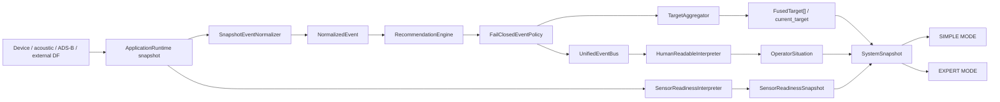

# ALGA VECTOR 1.0 — продуктовая архитектура операторской платформы

Статус документа: as-built описание текущего инкремента `1.0.0rc2` поверх
стабильной версии `0.7.0`.

Дата среза: 2 августа 2026 года.

Подпись продукта: **«Разработал: Буйвол и Задира»**.

## 0. Назначение и граница достоверности

Цель инкремента — превратить ALGA VECTOR из набора инженерных экранов и
отдельных событий в операторскую платформу:

```text
измерения → NormalizedEvent → FusedTarget → операторское представление
```

В текущем коде эта цепочка уже реализована. Она не является системой
автоматической физической идентификации объекта. Target в ALGA VECTOR —
ограниченная во времени программная проекция совместимых наблюдений, а не
доказательство того, что в пространстве находится конкретная модель аппарата.

Документ различает три состояния:

- **реализовано** — существует в текущем коде и имеет программные тесты;
- **интеграционная граница** — контракт существует, но конкретный аппаратный
  адаптер или источник должен быть предоставлен отдельно;
- **не реализовано** — UI или backend не должны создавать видимость этой
  возможности.

ALGA VECTOR не заявляет:

- дальность по RSSI, уровню спектра или одному пеленгу;
- координаты источника по одному азимуту;
- приближение или удаление объекта по изменению уровня;
- физическую идентичность, точную модель, принадлежность, намерение,
  государство, IFF или «свой/чужой»;
- распознавание БПЛА по факту активности на известной частоте;
- направление от TinySA или одиночного RTL-SDR;
- полноту гражданского ADS-B-контекста;
- активное воздействие, передачу или подавление радиосигнала.

Частота, ширина полосы, RSSI-подобная величина и форма спектра являются
наблюдаемыми признаками. Они не являются идентичностью объекта.

---

# A. Анализ версии 0.7.0

## A.1. Что в 0.7.0 уже было правильным

Версия 0.7.0 создала основу, которую не нужно переписывать:

- один `ApplicationRuntime` собирает состояние устройств, acquisition,
  RF-оценку, акустику, направление, ADS-B-контекст и sensor fusion;
- `UnifiedSignalProcessor` отделяет нормализацию и интерпретацию от UI;
- `NormalizedEvent` имеет версионированную, сериализуемую и fail-closed схему;
- `UnifiedEventBus` даёт один поток событий для разных представлений;
- `FailClosedEventPolicy` не допускает опасных утверждений только по RF;
- `HumanReadableInterpreter` выдаёт русскоязычный `OperatorSituation`;
- SIMPLE и EXPERT используют один runtime и переключаются без смены
  измерительного backend;
- UI не классифицирует IQ, waterfall или RSSI самостоятельно;
- сбой `signal_processor` превращается в видимый incident, а не в молчаливый
  переход к сырому или выдуманному выводу;
- real/demo/safe provenance сохраняется до операторского интерфейса;
- acquisition и hardware worker отделены от Qt-потока;
- структурированные журналы, support bundle и обработанный spectrum recorder
  уже дают основу диагностируемости.

Это важное свойство архитектуры: target-centric слой добавлен как проекция
поверх проверенных событий, а не как альтернативный pipeline.

## A.2. Почему 0.7.0 ещё воспринималась как инженерный интерфейс

`OperatorSituation` выбирал одно приоритетное событие и формировал текущий
headline. Это хорошо для «что произошло сейчас», но недостаточно для
операторского вопроса «это то же наблюдение или уже другое?».

Основные ограничения модели 0.7.0:

- несколько обновлений одного эпизода выглядели как лента отдельных событий;
- не было стабильного `target_id`;
- отсутствовал lifecycle цели;
- не было самостоятельного target-level source attribution;
- числовая эвристическая сила признаков воспринималась как главный ответ;
- состояние сенсоров было распределено по устройствам и ситуациям, а не сведено
  в семь стабильных операторских ролей;
- SIMPLE MODE оставался сокращённой версией dashboard, а не экраном решения;
- эксперт видел события и спектр, но не имел единого разбора одной цели.

## A.3. Где UX оставался инженерным

До target-centric инкремента пользователю требовалось самому связать:

1. событие RF;
2. акустическую аномалию;
3. пеленг;
4. состояние приёмника;
5. рекомендацию.

Такое связывание допустимо для диагностики, но не для основного операторского
экрана. Итоговая продуктовая иерархия должна отвечать в следующем порядке:

1. есть ли значимая активность;
2. какова рабочая гипотеза;
3. какая стадия подтверждения;
4. есть ли проверенный сектор;
5. что делать;
6. какие сенсоры реально участвовали и чего сейчас не хватает.

## A.4. Фактический статус текущего инкремента

В рабочем коде уже добавлены:

- пакет `alga_vector.targets`;
- `FusedTarget` и lifecycle;
- exact/semantic deduplication;
- fail-closed ассоциация событий;
- time decay и bounded retention;
- target-level recommendation engine;
- семь канонических readiness-ролей;
- target card и compact sector в SIMPLE MODE;
- отдельная страница «Цели» в EXPERT MODE;
- поля `targets`, `current_target`, `sensor_readiness` в `SystemSnapshot`;
- `schema_version: 7`.

При этом архитектура остаётся переходной в одном месте:

- если `current_target` существует, hero и карточка SIMPLE MODE используют
  один `FusedTarget`; `OperatorSituation` остаётся источником ленты событий и
  fallback при отсутствии цели;
- отдельного
  `TargetSituation`/`OperatorTargetPresentation` dataclass пока нет, поэтому UI
  объединяет старый и новый контракты через безопасный duck typing.

Это не silent failure: при отсутствии target данных SIMPLE MODE честно
использует текущую интерпретированную ситуацию. Но для финальной стабилизации
1.0 этот переходной шов должен быть включён в acceptance review.

---

# B. Целевая модель: event → target → operator presentation

## B.1. Фактический поток данных



Последовательность внутри `UnifiedSignalProcessor.process_snapshot()`:

1. `SnapshotEventNormalizer.normalize(snapshot)` создаёт нормализованные
   события и `SensorState`;
2. `RecommendationEngine.enrich()` назначает детерминированное действие;
3. `FailClosedEventPolicy.require_safe()` повторно проверяет событие;
4. событие передаётся в `TargetAggregator`;
5. принятое событие публикуется в `UnifiedEventBus`;
6. агрегатор продвигает lifecycle и строит target snapshots;
7. `SensorReadinessInterpreter` строит семь readiness-ролей;
8. `HumanReadableInterpreter` строит `OperatorSituation`;
9. runtime атомарно добавляет всё это в новый immutable `SystemSnapshot`.

UI получает только snapshot. Он не обращается к SDR backend напрямую.

## B.2. Схема нормализованного события

Текущие `NormalizedEventType`:

| Тип | Значение в операторской модели |
|---|---|
| `NOISE_BACKGROUND` | явное свежее заключение о фоне |
| `RADIO_ACTIVITY_DETECTED` | общая RF-активность без идентичности |
| `LIKELY_HANDHELD_RADIO` | вывод внешнего валидированного классификатора |
| `LIKELY_VIDEO_LINK` | вывод внешнего валидированного классификатора |
| `LIKELY_DRONE_SIGNATURE` | БПЛА-подобная сигнатура с независимым физическим подтверждением |
| `ADSB_CONTACT` | только гражданский кооперативный контекст |
| `ACOUSTIC_ANOMALY` | общая акустическая аномалия |
| `DIRECTION_ESTIMATED` | свежий валидированный внешний пеленг |
| `MULTISENSOR_CORRELATED` | временная корреляция независимых модальностей |
| `TARGET_CONFIRMED` | подтверждение с усиленным policy gate |
| `SENSOR_UNAVAILABLE` | потеря или ограничение наблюдения |

Схема события имеет собственную версию `"1.0"`. Она не связана с
`AppConfig.schema_version: 7`.

Каждое событие содержит:

- immutable `event_id`;
- `observed_at`, `received_at`, опциональный `valid_until`;
- `EventSeverity`;
- `ConfidenceScore`;
- `summary_ru`, `explanation_ru`, `recommendation_ru`;
- `SourceAttribution[]`;
- `EvidenceFact[]`;
- `limitations[]`;
- опциональные частоту, полосу, направление, episode и identity evidence.

`ConfidenceScore.value` — эвристическая сила признаков в диапазоне `0..1`.
Поле `is_calibrated_probability` всегда `False`; попытка объявить его
вероятностью отклоняется контрактом.

## B.3. Fail-closed identity policy

`LIKELY_HANDHELD_RADIO`, `LIKELY_VIDEO_LINK`, `LIKELY_DRONE_SIGNATURE` и
`TARGET_CONFIRMED` требуют `ValidatedIdentityEvidence` от явно атрибутированного
классификатора.

Дополнительно:

- `LIKELY_DRONE_SIGNATURE` требует минимум один независимый не-RF источник;
- `TARGET_CONFIRMED` требует минимум два независимых не-RF источника;
- подтверждающими физическими модальностями в этом gate считаются acoustic,
  passive radar или camera;
- RF, direction и classifier output не считаются независимым физическим
  подтверждением;
- high-consequence event обязан иметь срок действия;
- встроенный `SnapshotEventNormalizer` не создаёт
  `LIKELY_HANDHELD_RADIO`, `LIKELY_VIDEO_LINK`,
  `LIKELY_DRONE_SIGNATURE` или `TARGET_CONFIRMED`;
- такие события могут поступить только через проверенный внешний адаптер и
  `ApplicationRuntime.ingest_normalized_event()`.

Поэтому текущая сборка не выдаёт «дрон» только по частоте или одному импульсу.

## B.4. Target entity

`FusedTarget` — immutable проекция со следующими полями:

| Поле | Смысл |
|---|---|
| `target_id` | детерминированный идентификатор программного трека |
| `lifecycle` | свежесть и доступность трека |
| `confirmation_stage` | словесная стадия подтверждения |
| `probable_type` | наблюдаемая феноменология, не физическая идентичность |
| `technical_label` | тип ведущего backend-события |
| `operator_label` | короткая операторская формулировка |
| `operator_explanation` | объяснение состава и ограничений |
| `created_at`, `updated_at`, `last_seen` | временная шкала |
| `sensors_used` | уникальные виды участвовавших сенсоров |
| `source_attribution` | ограниченный вклад каждого `sensor_id` |
| `direction` | только свежий валидированный внешний пеленг |
| `zone` | только явно переданная свежая валидированная зона |
| `recommendation` | короткое и подробное действие |
| `evidence_strength` | эвристическая сила свежих вкладов |
| `evidence` | bounded materialized `EvidenceFact[]` из связанных событий |
| `limitations` | явные границы вывода |
| `recent_event_ids` | трассировка к событиям |
| `merged_from_target_ids` | аудит объединения треков |
| `tombstoned_at` | момент закрытия, только для tombstone |

`target_id` строится из SHA-256 semantic key первого наблюдения. Первые
20 hex-символов используются с префиксом `target-`; при коллизии в текущем
наборе добавляется числовой суффикс.

## B.5. Enum-модель

### Lifecycle

```python
class TargetLifecycle(StrEnum):
    ACTIVE = "active"
    HOLDING = "holding"
    STALE = "stale"
    TOMBSTONED = "tombstoned"
```

- `ACTIVE` — есть свежее activity event;
- `HOLDING` — свежее activity evidence временно отсутствует, но stale timeout
  ещё не достигнут;
- `STALE` — `last_seen` старше `stale_after_seconds`;
- `TOMBSTONED` — достигнут `retire_after_seconds`; запись удерживается
  ограниченное время для внутреннего аудита.

Runtime публикует active/holding/stale targets. Tombstone по умолчанию не
попадает в `SystemSnapshot.targets`.

### Стадия подтверждения

```python
class ConfirmationStage(StrEnum):
    BACKGROUND = "background"
    SUSPICIOUS_ACTIVITY = "suspicious_activity"
    LIKELY_SOURCE = "likely_source"
    LIKELY_TARGET = "likely_target"
    CONFIRMED_TARGET = "confirmed_target"
```

`BACKGROUND` является стадией общей ситуации, но конструктор `FusedTarget`
запрещает создавать target с этой стадией.

Фактическое отображение событий:

| Событие | Стадия target |
|---|---|
| `TARGET_CONFIRMED` | `CONFIRMED_TARGET` |
| `LIKELY_DRONE_SIGNATURE` | `LIKELY_TARGET` |
| `LIKELY_HANDHELD_RADIO` | `LIKELY_SOURCE` |
| `LIKELY_VIDEO_LINK` | `LIKELY_SOURCE` |
| `MULTISENSOR_CORRELATED` | `LIKELY_SOURCE` |
| сильная общая RF/acoustic активность (`>= 0.75`) | `LIKELY_SOURCE` |
| другая RF/acoustic активность | `SUSPICIOUS_ACTIVITY` |

Сильная общая RF-активность может стать «вероятным источником», но никогда
сама не становится «вероятной целью» или «подтверждённой целью».

### Рабочая феноменология

```python
class PhenomenologicalType(StrEnum):
    UNKNOWN_ACTIVITY = "unknown_activity"
    RF_ACTIVITY = "rf_activity"
    HANDHELD_RADIO_LIKE = "handheld_radio_like"
    VIDEO_LINK_LIKE = "video_link_like"
    ACOUSTIC_ACTIVITY = "acoustic_activity"
    MULTISENSOR_ACTIVITY = "multisensor_activity"
    VALIDATED_UAS_LIKE = "validated_uas_like"
```

Названия `*_LIKE` означают совместимость наблюдаемых признаков с классом, а
не установление физической модели.

### Результат обновления

```python
class TargetUpdateStatus(StrEnum):
    CREATED = "created"
    UPDATED = "updated"
    DUPLICATE = "duplicate"
    IGNORED = "ignored"
    CAPACITY_REJECTED = "capacity_rejected"
```

Каждый результат имеет `reason_code`; конфликт immutable event не
проглатывается, а вызывает `TargetInputError`.

### Канонические роли и readiness

```python
class SensorRole(StrEnum):
    TINYSA = "tinysa"
    RTL_SDR = "rtl_sdr"
    KRAKEN_SDR = "kraken_sdr"
    ACOUSTIC = "acoustic"
    ADSB = "adsb"
    PASSIVE_RADAR = "passive_radar"
    FUSION = "fusion"

class SensorReadinessLevel(StrEnum):
    READY = "ready"
    LIMITED = "limited"
    UNAVAILABLE = "unavailable"
```

`SensorReadinessSnapshot` валидирует уникальность ролей и требует присутствия
всех семи значений. Частичный snapshot считается ошибкой контракта.

### Deduplication status

```python
class EventDeduplicationStatus(StrEnum):
    ACCEPTED = "accepted"
    DUPLICATE = "duplicate"
    CONFLICT = "conflict"
```

## B.6. Deduplication

`EventDeduplicator` ведёт два bounded LRU-подобных индекса:

- exact index по `event_id`;
- semantic index по содержанию одного immutable наблюдения.

Поведение:

- тот же `event_id` и то же содержимое → `DUPLICATE`;
- тот же `event_id`, другое содержимое → `CONFLICT`;
- новый envelope id при том же semantic content → `DUPLICATE`;
- semantic key тот же, а содержимое различается → `CONFLICT`;
- свежее наблюдение с новым `observed_at` не подавляется как повтор.

Semantic key включает schema/event type, observation time, episode, список
сенсоров и observation id, частоту, полосу, направление и identity record.

## B.7. Correlation и объединение

Корреляция намеренно fail-closed. Временная близость сама по себе даёт не
больше `0.05` и не достигает порога `0.65`.

До расчёта score должны пройти:

- окно времени;
- совместимость частоты, если она есть у обеих сторон;
- совместимость направления, если оно есть у обеих сторон.

Фактические вклады association score:

| Признак | Вклад |
|---|---:|
| близость во времени | до `0.05` |
| общий `episode_id` | `0.70` |
| общий `observation_id` | `0.80` |
| общий `sensor_id` | `0.35` |
| совместимая частота | `0.30` |
| совместимое направление | `0.20` |
| fusion event с общим источником | `0.30` |
| уже встречался тот же event type | `0.05` |

Если два лучших кандидата отличаются менее чем на `0.05`, ассоциация считается
неоднозначной и создаётся отдельный track.

Fusion bridge может объединить несколько tracks только когда:

- событие имеет тип `MULTISENSOR_CORRELATED`;
- есть минимум два независимых подтверждающих `sensor_id`;
- каждому подтверждающему источнику соответствует ровно один track;
- один широкополосный приёмник не пытается объединить несколько разных
  частотных tracks.

Основным после merge становится самый старый track; остальные идентификаторы
сохраняются в `merged_from_target_ids`.

## B.8. Direction и zone

`DirectionEstimate` принимается только при одновременном выполнении условий:

- `validated_external=True`;
- timestamp timezone-aware;
- `observed_at <= now <= valid_until`;
- указан `calibration_id`;
- bearing находится в `[0, 360)`;
- uncertainty находится в `[0, 180]`;
- confidence находится в `[0, 1]` и проходит quality gate `>= 0.4`;
- `direction.source_id` совпадает с атрибутированным источником
  `SensorKind.DIRECTION_FINDER`.

Direction является контекстом и не создаёт target. Для присоединения к target
событие `DIRECTION_ESTIMATED` должно иметь явный `episode_id`, однозначно
связанный с одним track.

Если свежие достоверные пеленги противоречат друг другу больше суммы их
неопределённостей, target скрывает направление и добавляет limitation.

`ValidatedZone` также принимается только явно, с внешней валидацией,
`calibration_id`, freshness window и source id. Агрегатор не вычисляет зону.

Фактическая интеграционная граница текущего RC:

- normalizer может создать свежий standalone `DIRECTION_ESTIMATED` без target
  `episode_id`, но такой event остаётся нейтральным контекстом и не
  отображается как направление activity/target; event-level
  `OperatorSituation` и `FusedTarget` требуют точный общий `episode_id`,
  переданный внешним адаптером;
- `attach_validated_zone()` существует в `TargetAggregator`, но runtime facade
  и текущие экраны не предоставляют отдельный flow присоединения зоны;
- expanded MapPage не рисует `FusedTarget`, потому что target не содержит
  выдуманных координат.

## B.9. Time decay и lifecycle

Для события применяется:

```text
freshness = 2 ** (-age / decay_half_life_seconds)
```

После `maximum_age_seconds` или `valid_until` вклад равен нулю.

Дефолтная lifecycle-политика:

- correlation window: 12 с;
- deduplication window: 4 с;
- half-life: 18 с;
- stale: 30 с;
- retire: 90 с;
- tombstone retention: 300 с.

Если более сильное identity evidence истекло, а более слабая activity остаётся
свежей, стадия может понизиться. Это предотвращает вечное удержание сильного
вывода.

## B.10. Source attribution и evidence strength

Attribution группируется по `sensor_id`, а не по числу кадров. Для одного
сенсора:

- `observation_count` сохраняется для аудита;
- contribution берётся как максимальный decayed вклад, а не сумма повторов;
- independent confirmation считается текущим только при наличии свежего
  подтверждающего события;
- число источников ограничено 16.

Target-level evidence strength:

```text
0.75 × strongest_source
+ 0.25 × mean(next_two_sources)
```

Direction и ADS-B исключены из этого расчёта. Значение остаётся эвристикой и
показывается только в экспертном представлении.

## B.11. Recommendation system

Существуют два слоя рекомендаций:

- `signal_processor.RecommendationEngine` — действие для каждого event type;
- `targets.TargetRecommendationEngine` — действие с учётом стадии, типа,
  lifecycle и доступности direction.

Target recommendation содержит:

```python
TargetRecommendation(
    code: str,
    short_ru: str,
    detailed_ru: str,
)
```

Реализованные ветки:

- наблюдение без цели → продолжать мониторинг;
- подозрительная активность → ждать повторения и независимого подтверждения;
- radio-like source → сверить разрешённые радиосредства;
- другой вероятный источник → проверить независимым сенсором;
- вероятная цель → получить визуальное или иное независимое подтверждение;
- подтверждённая цель → выполнить утверждённый гражданский план безопасности;
- stale → не использовать как текущую цель и повторно получить данные;
- tombstone → считать наблюдение закрытым.

Рекомендации не управляют внешними исполнительными средствами.

---

# C. UX SIMPLE MODE

## C.1. Назначение

SIMPLE MODE — основной экран принятия решения. Он отвечает за 1–2 секунды:

- есть ли значимая активность;
- что наблюдается вероятнее всего;
- какова стадия подтверждения;
- есть ли проверенный сектор;
- что делать дальше.

За 10 секунд оператор может увидеть:

- участвующие сенсоры;
- отсутствующие или ограниченные сенсоры;
- влияние отсутствия каждого сенсора;
- последние важные события.

## C.2. Реализованная иерархия

```text
┌─────────────────────────────────────────────────────────────────┐
│ ОБСТАНОВКА СЕЙЧАС                                               │
│ [ТИШИНА/ФОН/АКТИВНОСТЬ/ЦЕЛЬ]  крупный headline + объяснение     │
├──────────────────────────────────────┬──────────────────────────┤
│ ТЕКУЩАЯ ЦЕЛЬ                         │ НАПРАВЛЕНИЕ              │
│ словесная стадия                     │ compact sector           │
│ рабочая гипотеза                     │ либо честный fallback    │
│ краткое объяснение                   │ без дальности            │
│ last seen + sensors                  │                          │
├──────────────────────────────────────┴──────────────────────────┤
│ ЧТО ДЕЛАТЬ ДАЛЬШЕ: короткое действие + подробное объяснение     │
├─────────────────────────────────────────────────────────────────┤
│ Ограничение подтверждения / отсутствующая возможность           │
├─────────────────────────────────────────────────────────────────┤
│ 3–5 последних важных событий  [Показывать только важное]        │
├─────────────────────────────────────────────────────────────────┤
│ TinySA │ RTL-SDR │ Kraken │ Acoustic │ ADS-B │ Radar │ Fusion   │
└─────────────────────────────────────────────────────────────────┘
```

Реализующие классы:

- `SimpleSituationPage`;
- `TargetSummaryCard`;
- `ConfirmationStageBadge`;
- `CompactSectorView`;
- `SensorReadinessStrip`;
- `SensorReadinessTile`.

## C.3. Режимы общей ситуации

UI использует четыре операторских режима:

| Backend mode | Текстовый смысл |
|---|---|
| `silence` | нет свежего вывода или наблюдение ограничено |
| `background` | получено явное свежее заключение о фоне |
| `activity` | есть активное событие |
| `confirmed_target` | есть policy-valid `TARGET_CONFIRMED` |

Отсутствие событий не превращается автоматически в «фон чистый». Для этого
нужно свежее `NOISE_BACKGROUND` при доступном RF-наблюдении.

## C.4. Словесные стадии вместо процентов

Видимая карточка SIMPLE MODE использует:

- «Фон»;
- «Подозрительная активность»;
- «Вероятный источник»;
- «Вероятная цель»;
- «Подтверждённая цель».

Скрытые compatibility labels для 0.7 остаются в объекте страницы, но числовая
confidence не входит в визуальную карточку target.

## C.5. Примеры корректных фраз

Допустимые формулировки:

- «Активных событий нет. Чистый фон не подтверждён.»
- «Обнаружена RF-активность в текущем окне наблюдения.»
- «Форма активности совместима с узкополосной передачей; физический источник
  не установлен.»
- «Несколько сенсоров видят согласованную активность; тип объекта не
  установлен.»
- «Пеленгация недоступна: нет свежего валидированного внешнего DF-наблюдения;
  источник может отсутствовать, быть stale, не пройти quality gate или иметь
  невалидную калибровку. Конкретный KrakenSDR adapter в поставку не входит.»
- «Источник в секторе 95–120°; дальность не измеряется.»
- «Вероятная цель — требуется визуальное или иное независимое подтверждение.»

Недопустимые формулировки без отдельного evidence:

- «Дрон на расстоянии 2 км»;
- «Цель приближается»;
- «Это конкретная модель БПЛА»;
- «Координаты рассчитаны по азимуту»;
- «На частоте обнаружен военный дрон».

## C.6. Compact sector

`CompactSectorView` рисует только:

- окружность и угловые метки;
- сектор неопределённости;
- bearing line;
- источник пеленга в тексте.

Компонент намеренно не содержит:

- дальностных колец;
- точки объекта на плоскости;
- географических координат;
- оценки расстояния.

Без валидированного direction компонент показывает «нет валидного пеленга».
Невалидированный bearing в UI скрывается.

## C.7. Последние события

На экране выводится не более пяти событий. Фильтр «Показывать только важное»
включён по умолчанию. Важными считаются warning/alarm/critical и
high-consequence identity events.

Лента остаётся вторичной относительно hero и target card.

## C.8. Sensor readiness strip

Полоса всегда содержит семь ролей:

1. TinySA;
2. RTL-SDR;
3. KrakenSDR;
4. Acoustic;
5. ADS-B;
6. Passive radar;
7. Fusion.

Каждая tile показывает `ready`, `limited` или `unavailable`, короткую причину и
полный tooltip:

```text
сенсор
состояние
причина
влияние на вывод
```

Отсутствующая роль не исчезает с экрана. Это предотвращает ошибочное
впечатление, что неподключённый сенсор участвовал в решении.

## C.9. Текущие UX-границы

- Если `current_target` существует, hero и target card используют один
  `FusedTarget`; `OperatorSituation` остаётся источником ленты событий и
  fallback при отсутствии цели.
- Validated zone пока не имеет отдельного видимого блока.
- Compact sector реализован; target-linked tactical map не реализован.
- Воздействие readiness показывается главным образом в tooltip, а не постоянно
  развёрнутым текстом.
- Полноценная keyboard/accessibility приёмка не заявлена, хотя widgets имеют
  object names, word wrap и частичные accessible descriptions.

---

# D. UX EXPERT MODE

## D.1. Навигация

В EXPERT MODE доступны:

- Обстановка;
- Обзор;
- Цели;
- Устройства;
- Спектр;
- События;
- Направление;
- Карта;
- Диагностика;
- Настройки.

В SIMPLE MODE скрыты инженерные страницы, но они не удаляются из backend.
Переключение сохраняет `ui.experience_level` как `guided` или `expert`.

## D.2. Реализованная страница «Цели»

`ExpertTargetsPage` состоит из рабочих зон:

1. таблица targets:
   - ID;
   - lifecycle;
   - стадия подтверждения;
   - рабочая гипотеза;
   - last seen;
2. overview выбранной цели:
   - target ID;
   - lifecycle;
   - confirmation stage;
   - рабочая гипотеза;
   - evidence strength;
   - basis;
   - операторское резюме;
3. временная шкала;
4. проверенное направление;
5. рекомендация;
6. source attribution;
7. evidence/recent event references;
8. ограничения.

Stale target получает видимое предупреждение и не выдаётся как текущая
обстановка.

## D.3. Числовая сила признаков

`ExpertTargetsPage` показывает числовое значение только при
`experience_level == "expert"`. Рядом всегда присутствует basis:

> Числовая оценка является силой признаков, а не вероятностью типа объекта.

Это число не переносится в target card SIMPLE MODE.

## D.4. Spectrum, diagnostics и map

Существующие страницы 0.7 сохранены:

- spectrum/waterfall и технические измерения;
- device states;
- raw normalized events;
- incidents и structured logs;
- direction diagnostics;
- map и location контекст;
- settings и hardware discovery.

Они не обходят `signal_processor` при формировании операторского вывода.

Фактические ограничения:

- MapPage является отдельным географическим контекстом и не локализует
  `FusedTarget`;
- target backend сохраняет bounded materialized `EvidenceFact[]` и
  `recent_event_ids`; экспертный экран показывает факты отдельно, а event id
  остаются трассировкой и не выдаются за доказательства;
- отдельного target replay engine нет;
- запись processed spectrum существует, но не равна воспроизведению target
  lifecycle;
- bundled calibration workflow для KrakenSDR отсутствует;
- экспертные страницы ещё требуют отдельной визуальной приёмки на плотность,
  resize и длинные русские строки.

---

# E. UI system

## E.1. Реализованные цветовые tokens

`src/alga_vector/ui/theme.py` задаёт непрозрачную charcoal palette:

| Token | Значение | Назначение |
|---|---|---|
| `BG` | `#050707` | основной почти чёрный фон |
| `BG_ALT` | `#070A0A` | альтернативный фон |
| `NAV` | `#0A0F0E` | navigation/header и внутренние canvas |
| `SURFACE` | `#111817` | основная панель |
| `SURFACE_ALT` | `#16201E` | вторичная панель/контрол |
| `BORDER` | `#1D2926` | тихая граница |
| `BORDER_STRONG` | `#344540` | усиленная граница |
| `TEXT` | `#EDF4F1` | основной текст |
| `TEXT_SECONDARY` | `#A6B2AD` | пояснение |
| `MUTED` | `#707D78` | вторичный metadata text |
| `READY` | `#25C78D` | готовность/подтверждённое состояние |
| `TEAL` | `#35B7AA` | information/active |
| `WARNING` | `#E1A84B` | ограничение/ожидание |
| `CRITICAL` | `#E35B65` | ошибка/критический статус |

Текущая реализация использует flat opaque panels. Настоящее размытие
background, прозрачное стекло и сложные shader effects не реализованы и не
заявляются.

## E.2. Типографика

- bundled `Golos Text Regular` и `SemiBold`;
- fallback: `Segoe UI`, затем системный Qt font;
- базовый размер: 12 px;
- section heading: 14 px;
- page heading: 20 px;
- target type: 23 px;
- hero headline: 29 px;
- важные статусы используют semibold;
- кириллица не зависит от наличия шрифта на Windows.

Специальный глобальный tabular-number feature не настроен. Числовые таблицы
используют тот же UI font.

## E.3. Геометрия

- окно по умолчанию: `1440 × 900`;
- minimum: `1120 × 720`;
- navigation: 112 px;
- header: 64 px;
- footer: 28 px;
- border radius: 4–7 px;
- основные интервалы: 5–18 px;
- SIMPLE content размещён в vertical scroll area без горизонтального scroll.

## E.4. Состояния

Единый смысл цветов:

- green/emerald — готово или policy-valid подтверждение;
- teal — активное информационное состояние;
- amber — ожидание, stale, limited или необходимость подтверждения;
- red — критическая ошибка или alarm;
- grey — нейтральное/недоступное.

Цвет никогда не является единственным носителем смысла: основные badges имеют
текст.

## E.5. Компоненты

Основные reusable components:

- `Panel`;
- `StatusBadge`;
- `InlineNotice`;
- `ProvenanceBanner`;
- `SignalAlertBanner`;
- `TargetSummaryCard`;
- `ConfirmationStageBadge`;
- `CompactSectorView`;
- `SensorReadinessStrip`;
- `SensorReadinessTile`;
- `SpectrumPlot`, `WaterfallPlot`, `DirectionPlot`.

## E.6. Motion

Быстрые и мягкие анимации были частью дизайнерского направления, но текущий
PySide6-код не содержит общей animation system. Состояния обновляются раз в
секунду без обязательных переходных эффектов. Это честное текущее состояние,
а не дефект backend.

---

# F. Backend target-centric слоя

## F.1. `TargetAggregator`

Ответственность:

- принимать только `NormalizedEvent`;
- выполнять idempotency и conflict detection;
- не создавать target из background, ADS-B или sensor-unavailable;
- ассоциировать совместимые activity events;
- присоединять direction только по явной связи;
- объединять tracks только по строгому fusion bridge;
- продвигать lifecycle;
- строить immutable `FusedTarget`;
- ограничивать память и число активных целей.

Публичные методы:

```python
ingest(event, now=None) -> TargetUpdate
tick(now) -> tuple[FusedTarget, ...]
targets(now, include_stale=True, include_tombstones=False)
active_targets(now)
attach_validated_zone(target_id, zone, now)
reset()
```

Внутреннее состояние защищено `RLock`. Время оценки обязано быть
неубывающим.

## F.2. Bounded memory

Фактические внутренние лимиты по умолчанию:

| Лимит | Значение |
|---|---:|
| активные targets | 64 |
| tombstones | 128 |
| events на target | 64 |
| sources на target | 16 |
| записи dedup index | 4096 |
| tombstone retention | 300 с |

При достижении active capacity новый несвязанный target отклоняется с
`TARGET.ACTIVE_CAPACITY_REACHED`. Существующие цели не удаляются случайно ради
новой.

## F.3. Readiness interpreter

`SensorReadinessInterpreter` использует:

- `DeviceSnapshot.state`;
- device health;
- `last_data_at`;
- `DirectionSnapshot`;
- `AcousticAssessment`;
- `CivilAirspaceSnapshot`;
- `FusionDecision`.

Device `READY/STREAMING` считается ready, если данные не устарели. Состояния
discovered/probing/starting/stopping/degraded/reconnecting считаются limited.
Absent/failed/quarantined/disabled считаются unavailable.

По умолчанию данные устройства старше 5 секунд понижают readiness до limited.

Fusion:

- RF + Acoustic и состояние fusion engine → ready;
- только одна модальность → limited;
- нет engine state или входов → unavailable.

ADS-B остаётся контекстом и прямо сообщает, что это не IFF.

## F.4. Runtime integration

`ApplicationRuntime.__init__()` создаёт `TargetAggregatorConfig` из
`AppConfig.target_tracking` и внедряет агрегатор в `UnifiedSignalProcessor`.

После успешного `process_snapshot()` runtime публикует:

```python
SystemSnapshot(
    operator_situation=...,
    normalized_events=...,
    targets=...,
    current_target=...,
    sensor_readiness=...,
)
```

`current_target` — первый active/holding target после сортировки по стадии,
затем по `last_seen`. Stale targets остаются в общем списке, но не выбираются
как текущие.

Если signal processor падает:

- создаётся incident `SIGNAL_PROCESSOR.FAILED`;
- readiness ограничивается максимум 75%;
- ошибка пишется в structured log;
- UI не получает raw fallback как операторское заключение.

`ingest_normalized_event()` является внешней точкой для optional
classifier/camera/passive-radar adapters. Она применяет тот же recommendation,
policy и target aggregation.

## F.5. Config schema 6

Добавленная секция:

```yaml
schema_version: 7
target_tracking:
  correlation_window_seconds: 12.0
  deduplication_window_seconds: 4.0
  decay_half_life_seconds: 18.0
  stale_after_seconds: 30.0
  retire_after_seconds: 90.0
  maximum_active_targets: 64
```

`TargetTrackingConfig` — strict Pydantic model:

| Поле | Диапазон |
|---|---:|
| `correlation_window_seconds` | 1..300 |
| `deduplication_window_seconds` | 0.1..60 |
| `decay_half_life_seconds` | 1..600 |
| `stale_after_seconds` | 5..900 |
| `retire_after_seconds` | 10..3600 |
| `maximum_active_targets` | 1..512 |

Cross-field invariants:

- stale должен быть больше correlation window;
- retire должен быть больше stale;
- half-life не должен превышать retire.

Миграция `5 → 6` добавляет пустую `target_tracking` секцию, после чего
применяются безопасные defaults. Она не включает новый сенсор, demo source или
identity classifier.

В schema 6 также остаются существующие секции acoustic, airspace, fusion,
location, map, devices, spectrum, storage, UI и logging.

## F.6. Read/write и concurrency

- `FusedTarget`, event contracts и readiness snapshots immutable;
- target aggregator и processor target state защищены `RLock`;
- dedup indexes bounded;
- порядок времени проверяется;
- runtime публикует один snapshot revision;
- UI читает latest snapshot и не изменяет target state;
- config save использует temporary file, `fsync` и atomic replace;
- structured failures имеют reason code.

## F.7. Реальные backend-ограничения

- bundled classifier отсутствует;
- bundled camera integration отсутствует;
- bundled KrakenSDR adapter отсутствует;
- bundled live microphone capture отсутствует: acoustic core принимает явно
  переданный PCM;
- dump1090 не управляется приложением: читается явно настроенный локальный
  JSON;
- passive radar присутствует как schema/readiness integration boundary, но
  bundled live adapter отсутствует;
- target state хранится в памяти runtime и не имеет отдельного persistent
  target journal/replay;
- `ValidatedZone` не подключена к runtime facade;
- target-level evidence materialized и bounded, но не имеет отдельного
  persistent evidence journal/replay вне существующего event storage;
- калиброванные precision/recall и probability отсутствуют;
- аппаратная точность зависит от внешней калибровки и не доказывается unit
  tests.

---

# G. Реальные изменения в коде

## G.1. Новые production-файлы

```text
src/alga_vector/targets/
├── __init__.py
├── models.py
├── dedup.py
├── aggregator.py
├── recommendations.py
└── readiness.py

src/alga_vector/ui/pages/
└── targets.py

src/alga_vector/ui/widgets/
├── target_card.py
├── sector_view.py
└── sensor_readiness.py

tests/
├── test_target_tracking.py
├── test_ui_target_situation.py
└── test_ui_targets_page.py
```

## G.2. Изменённые integration-файлы

| Файл | Фактическое изменение |
|---|---|
| `src/alga_vector/config/models.py` | `TargetTrackingConfig`, schema 6 |
| `src/alga_vector/config/service.py` | миграция 5 → 6 |
| `src/alga_vector/assets/config/default.yaml` | target defaults |
| `src/alga_vector/domain/models.py` | target/readiness fields в `SystemSnapshot` |
| `src/alga_vector/signal_processor/schema.py` | human-readable aliases/properties |
| `src/alga_vector/signal_processor/processor.py` | target/readiness orchestration |
| `src/alga_vector/application/runtime.py` | config wiring и snapshot publication |
| `src/alga_vector/ui/main_window.py` | маршрут «Цели» в EXPERT MODE |
| `src/alga_vector/ui/pages/simple_situation.py` | target-centric layout |
| `src/alga_vector/ui/pages/__init__.py` | export `ExpertTargetsPage` |
| `src/alga_vector/ui/widgets/__init__.py` | exports новых widgets |
| `src/alga_vector/ui/runtime.py` | unavailable snapshot compatibility |
| `tests/test_config.py` | schema 6 и migration coverage |
| `tests/test_runtime_operator_situation.py` | runtime target fields/failure path |
| `tests/test_signal_processor_normalizer.py` | target projection coverage |
| `tests/test_signal_processor_schema.py` | human-readable contract coverage |
| `tests/test_ui_simple_situation.py` | обновлённый SIMPLE contract |

## G.3. Основные классы по слоям

| Слой | Классы |
|---|---|
| event contract | `NormalizedEvent`, `ConfidenceScore`, `DirectionEstimate`, `ValidatedIdentityEvidence` |
| policy | `FailClosedEventPolicy`, `RecommendationEngine` |
| delivery | `UnifiedEventBus` |
| target contract | `FusedTarget`, `TargetSourceAttribution`, `TargetRecommendation`, `ValidatedZone` |
| target engine | `TargetAggregator`, `EventDeduplicator`, `TargetRecommendationEngine` |
| readiness | `SensorReadinessInterpreter`, `SensorReadinessSnapshot` |
| runtime facade | `UnifiedSignalProcessor`, `ApplicationRuntime`, `SystemSnapshot` |
| simple UI | `SimpleSituationPage`, `TargetSummaryCard`, `CompactSectorView`, `SensorReadinessStrip` |
| expert UI | `ExpertTargetsPage` |

## G.4. Integration без переписывания 0.7

Интеграция выполнена через расширение существующего snapshot:

```python
base_snapshot = SystemSnapshot(...)
operator_situation = processor.process_snapshot(base_snapshot)

published_snapshot = replace(
    base_snapshot,
    operator_situation=operator_situation,
    normalized_events=processor.event_bus.recent(limit=64),
    targets=processor.targets,
    current_target=processor.current_target,
    sensor_readiness=processor.sensor_readiness,
)
```

Существующие device, spectrum, map, direction, acoustic, ADS-B и fusion
subsystems не переписаны. Их данные входят через прежний `SystemSnapshot`.

SIMPLE MODE принимает как новый target contract, так и 0.7
`OperatorSituation`. Это обеспечивает обратную совместимость, но является
временным compatibility layer, который следует удалить только после
стабилизации единого presentation contract.

## G.5. Что нельзя добавлять «для красоты»

Следующие значения нельзя генерировать в UI:

- synthetic distance;
- synthetic coordinates;
- target point на map без validated position source;
- bearing от RSSI;
- identity от frequency lookup;
- calibrated probability без calibration artifact;
- «подтверждённая цель» из общей sensor correlation.

UI должен отображать отсутствие capability как данные, а не скрывать его.

---

# QA. Как проверяется target-centric инкремент

## QA.1. Автоматические контракты

`tests/test_target_tracking.py` проверяет:

- соответствие config и временные invariants;
- exact и semantic duplicates;
- conflict одного event id;
- merge по источнику и совместимой частоте;
- запрет merge только по времени;
- строгий fusion bridge;
- невозможность promotion generic RF до likely/confirmed target;
- identity-gated stages;
- deterministic active/holding/stale/tombstone;
- de-escalation истёкшей confirmed-цели и безопасное HOLDING;
- half-life decay;
- отсутствие суммирования повторов одного сенсора;
- fail-closed direction quality, attribution, episode association и conflict;
- delayed expired ingest, exact stale boundary и HOLDING capacity;
- conflicting same-stage classifications → unknown/conflict;
- только явную fresh validated zone;
- active capacity;
- неоднозначный fusion;
- bounded dedup flood;
- семь readiness slots;
- device/readiness/fusion mapping;
- stale и single-modality degradation.

`tests/test_ui_target_situation.py` проверяет:

- приоритет `current_target` в карточке SIMPLE MODE;
- словесную стадию вместо процента;
- отсутствие выдуманной дальности/позиции;
- скрытие невалидированного bearing;
- семь readiness tiles и actionable tooltips.

`tests/test_ui_targets_page.py` проверяет:

- empty state;
- source attribution и validated direction;
- скрытие raw confidence в guided snapshot;
- stale target/direction;
- единый freshness verdict для таблицы, banner, badges, direction и action;
- скрытие stale/holding/invalid legacy recommendations;
- 1440×900 layout с historical banner без обрезания overview;
- выбор другой цели;
- совместимость с фактическими именами `FusedTarget`.

Существующие тесты signal processor дополнительно проверяют:

- запрет drone signature по frequency/RSSI;
- требования classifier и независимых физических источников;
- freshness внешнего direction;
- запрет cross-episode direction и context-over-activity priority inversion;
- фильтрацию timeline без изменения primary situation;
- отсутствие ложного «чистого фона»;
- отсутствие identity из generic RF decision;
- явный fallback без DF;
- processor failure без raw UI fallback.

## QA.2. Рекомендуемый программный gate

```powershell
python -m ruff check src tests
python -m mypy src/alga_vector
$env:QT_QPA_PLATFORM = "offscreen"
python -m pytest -p no:cacheprovider
```

Для точечного target gate:

```powershell
python -m pytest -p no:cacheprovider `
  tests/test_target_tracking.py `
  tests/test_ui_target_situation.py `
  tests/test_ui_targets_page.py `
  tests/test_runtime_operator_situation.py `
  tests/test_signal_processor_schema.py `
  tests/test_signal_processor_normalizer.py `
  tests/test_signal_processor_interpretation.py
```

Фактический локальный gate `1.0.0rc2`: Ruff PASS, strict Mypy PASS по
115 source-файлам, pytest PASS — 559 тестов, source/frozen/portable smoke PASS.
Артефакт, SHA-256 и среда зафиксированы в
[`BUILD_REPORT_100RC2_RU.md`](BUILD_REPORT_100RC2_RU.md).

## QA.3. Обязательная ручная UI-приёмка

Проверить на `1120×720`, `1440×900` и high-DPI:

1. headline читается за 2 секунды;
2. target card не показывает процент;
3. important feed не вытесняет главное;
4. long Russian text не обрезает действие;
5. отсутствие KrakenSDR даёт явный fallback;
6. stale direction исчезает;
7. switch SIMPLE ↔ EXPERT не меняет backend или provenance;
8. target selection обновляет все экспертные панели;
9. incident signal processor виден;
10. demo data всегда обозначены как simulated.

## QA.4. Что unit/UI tests не доказывают

До production acceptance остаются отдельными gates:

- реальный KrakenSDR и его calibration/freshness;
- полевой RF/acoustic dataset;
- precision/recall внешнего classifier;
- false-positive/false-negative budget;
- real hardware hot-unplug и длительный soak на целевой конфигурации;
- end-to-end latency от сенсора до alert;
- операторское usability testing;
- installer/signing и tagged GitHub Release;
- воспроизводимость поведения на конкретных антеннах, фильтрах и RF-среде.

Автоматические тесты доказывают software invariants, но не физическую точность.

---

# H. Результат 1.0

## H.1. Как выглядит целевой продукт

Версия 1.0 в текущем архитектурном направлении — это один backend с двумя
представлениями:

- SIMPLE MODE отвечает «что происходит, что подтверждено и что делать»;
- EXPERT MODE отвечает «какие события, источники, признаки, сроки и
  ограничения привели к этому выводу».

Обе стороны читают один `SystemSnapshot`. Ни один UI-режим не имеет отдельной
«упрощённой» детекции.

## H.2. Принципиальное отличие от 0.7.0

| 0.7.0 | 1.0 target-centric инкремент |
|---|---|
| приоритетное событие | событие + устойчивый target track |
| лента эпизодов | target с lifecycle |
| sensor state распределён | семь readiness-ролей |
| confidence в центре внимания | словесная стадия в SIMPLE |
| направление как отдельная функция | только fresh validated direction у presentation |
| рекомендации по событию | рекомендации по event и target lifecycle |
| инженерный разбор вручную | attribution и limitations у выбранной цели |
| риск визуально связать несвязанные события | fail-closed association |

## H.3. Что уже можно считать готовым основанием 1.0

- модель event → target → presentation;
- bounded и deterministic target aggregation;
- explicit lifecycle;
- словесные стадии;
- fail-closed identity и direction;
- target-level source attribution;
- sensor readiness;
- SIMPLE target card;
- EXPERT target breakdown;
- schema 6 и migration;
- runtime snapshot integration;
- программные регрессионные тесты.

## H.4. Что остаётся до утверждения стабильной 1.0

Необходимо закрыть не обещаниями, а приёмочными результатами:

1. заменить безопасный duck typing на отдельный строго типизированный
   `OperatorTargetPresentation`, сохранив приоритет `current_target` для hero;
2. либо подключить validated zone к runtime/UI, либо убрать её из публичной
   продуктовой спецификации;
3. добавить persistent target/evidence journal и replay, если lifecycle должен
   переживать перезапуск runtime;
4. провести real hardware/field/soak acceptance;
5. провести UX-проверку на целевых операторах;
6. проверить tagged GitHub Release и целевые Windows-системы;
7. зафиксировать classifier validation artifacts до включения
   high-consequence identity events.

## H.5. Итог

Текущий `1.0.0rc2` — не косметический redesign 0.7.0. В нём действительно
появилась target-centric программная модель, отдельный lifecycle, bounded
correlation, readiness и два уровня представления.

Главное product quality свойство — честность вывода:

- при наличии только RF система говорит об RF-активности;
- при наличии multisensor correlation система говорит о согласованной
  активности;
- при отсутствии DF система не рисует сектор;
- при наличии одного bearing система не вычисляет дальность и координаты;
- identity stage появляется только через валидированный classifier и
  необходимое независимое физическое evidence;
- устаревшие данные перестают считаться текущими.

Именно эта граница между «наблюдается», «вероятно» и «подтверждено» делает
ALGA VECTOR операторской платформой, а не демонстрационным dashboard.
