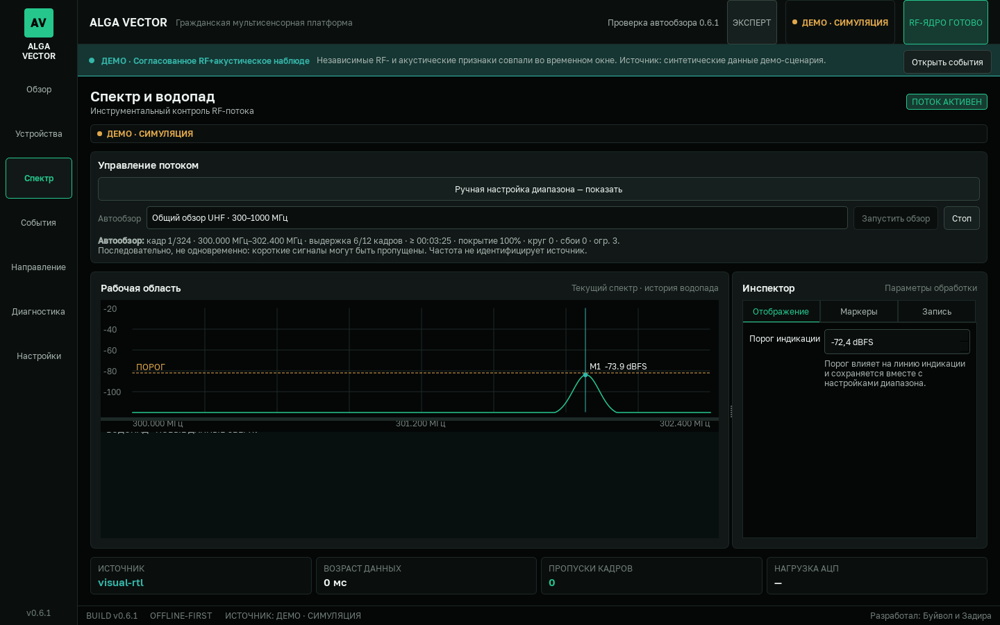

# ALGA VECTOR 0.6.1 — отчёт сборки

Дата проверки: 2026-07-26  
Целевая платформа: Windows 11 x64, AMD64  
Результат release gate: **PASS**

## Готовый артефакт

- файл: `dist/ALGA_VECTOR-0.6.1-Windows-x64-onedir.zip`;
- размер: 64 430 390 байт, около 61,45 MiB;
- SHA-256:
  `959EA2A6B0553475AFF6DB1EA1E304EA857D27996701A4E181CAE70FBF8AE26A`;
- checksum-файл:
  `dist/ALGA_VECTOR-0.6.1-Windows-x64-onedir.zip.sha256.txt`;
- GUI FileVersion/ProductVersion: `0.6.1.0`;
- CLI FileVersion/ProductVersion: `0.6.1.0`.

Checksum пересчитан после сборки и совпадает с опубликованным значением.
Архив сначала создавался под временным именем, затем распаковывался и
проверялся. Финальные ZIP и checksum появились в `dist` только после
успешного portable smoke.

Сборка выполнена с `-SkipInstaller`: проверенный результат этого отчёта —
portable onedir ZIP. Inno Setup installer не выпускался.

## Автоматические проверки

| Проверка | Результат |
|---|---|
| Ruff | PASS |
| strict Mypy | PASS, 95 source-файлов |
| pytest | PASS, 431 тест |
| source hardware preflight | PASS |
| source default Live smoke | PASS |
| source explicit Live smoke | PASS |
| source Safe smoke | PASS |
| source Demo smoke | PASS |
| frozen CLI hardware preflight | PASS |
| frozen CLI default Live / explicit Live / Safe / Demo smoke | PASS |
| frozen GUI default Live / Safe headless smoke | PASS |
| portable archive extract + preflight + Safe smoke | PASS |
| повторный smoke точного финального ZIP: CLI и GUI | PASS |
| SHA-256 final ZIP | PASS |

Повторный smoke финального архива выполнялся в отдельном QA-профиле
приложения, чтобы не смешивать его с пользовательскими настройками и уже
открытыми экземплярами.

## Среда сборки

- Windows `10.0.26200`, определяется как Windows 11;
- Python `3.12.10`, AMD64;
- PyInstaller `6.21.0`;
- PySide6 Essentials `6.11.1`;
- NumPy `2.5.1`;
- Pydantic `2.13.4`;
- PyYAML `6.0.3`;
- platformdirs `4.11.0`;
- pyserial `3.5`;
- pyrtlsdr `0.5.0`;
- pyusb `1.3.1`;
- pytest `8.4.2`;
- Ruff `0.16.0`;
- Mypy `1.20.2`.

Build script проверяет совпадение версии package, `pyproject.toml`,
Inno Setup metadata, quick-start, release notes и EXE resources. Имя x64
разрешается только при AMD64/64-bit Python.

## Что подтверждено в 0.6.1

- capability-gated последовательный автообзор общих VHF/UHF/L/S/C областей
  и всего подтверждённого диапазона выбранного приёмника;
- generic RTL-SDR ограничен подтверждённым профилем 24–1766 МГц;
- источник плана закреплён за одним приёмником, fallback другого устройства
  отклоняется;
- каждый участок имеет отдельные baseline и temporal-состояние;
- первый кадр после принятой перестройки является warm-up и не участвует в
  temporal-решении;
- отложенный кадр старого режима при start/stop не публикуется под новой
  настройкой;
- stale confirmed-состояние не оживает после одного кадра при возврате в
  давно не наблюдавшееся окно;
- аппаратная sequence сохраняется в опубликованных frame/assessment;
- уведомления выдаются только для `confirmed`/`holding` и описывают общие
  RF-формы: voice-like, packet-like, carrier, narrowband/broadband burst,
  interference/noise и unknown;
- измеренный азимут допускается только от свежего валидированного внешнего
  DF-источника;
- RSSI используется только как тренд принятого уровня, без вычисления
  расстояния;
- Expert UI на 1120×720 не перекрывает элементы: ручные параметры доступны
  через раскрываемый блок, автообзор остаётся видимым сразу.

## Что не заявляется

- Частота и одиночный спектр не устанавливают «дрон / не дрон», модель,
  оператора, назначение или национальную принадлежность источника.
- Один tinySA, RTL-SDR или HackRF не измеряет bearing.
- Расстояние не определяется: RSSI зависит от мощности, антенны и трассы.
- Один SDR просматривает окна последовательно, не одновременно, поэтому
  короткие эпизоды могут быть пропущены.
- Полевая probability of detection и false-alarm rate не заявлены без
  размеченного validation dataset.

## Открытые acceptance-риски

Автоматический gate подтверждает программную целостность, но в этой среде не
были подключены физические RTL-SDR, HackRF или tinySA. Перед эксплуатацией
нужна отдельная матрица Windows/driver/firmware/USB/антенна/аттенюатор и
полевые тесты на известном легальном RF-источнике.

Для tinySA нужно отдельно измерить реальный интервал между sweep-кадрами.
Если он превышает temporal gap текущей политики, система должна оставаться в
неподтверждённом состоянии, а не создавать уверенное уведомление.

Сборка фиксирует фактические версии ключевых зависимостей в этом отчёте, но
полного lock-файла, SBOM и git/source manifest у данного projectless workspace
пока нет.
