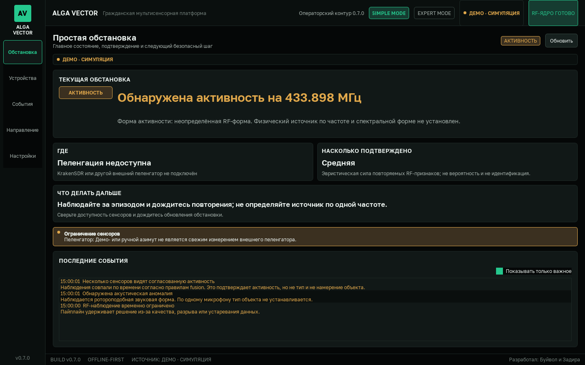
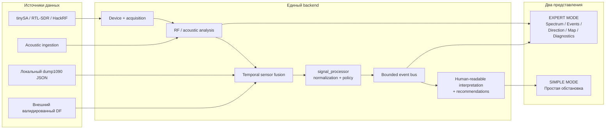
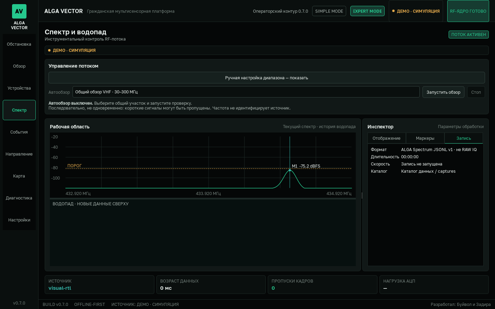

# ALGA VECTOR — полный обзор проекта

> Актуальная версия: **0.7.0**  
> Платформа: **Windows 11 x64**, Python 3.12, PySide6  
> Разработал: **Буйвол и Задира**

ALGA VECTOR — русскоязычное offline-first Windows-приложение для законного
пассивного наблюдения за радиообстановкой и объединения доступных
мультисенсорных признаков. Проект ориентирован на понятную операторскую работу:
технические измерения проходят через единый нормализующий слой, после чего
пользователь получает краткое описание ситуации, качество данных, доступное
направление и следующий безопасный шаг.



## Быстрая навигация

- [История и статус версий](../VERSIONS.md)
- [Быстрый старт](QUICK_START_RU.txt)
- [Архитектура SIMPLE MODE / EXPERT MODE](SIMPLE_EXPERT_ARCHITECTURE_RU.md)
- [Примечания к выпуску 0.7.0](RELEASE_070_RU.md)
- [Отчёт сборки 0.7.0](BUILD_REPORT_070_RU.md)
- [Как участвовать в разработке](../CONTRIBUTING.md)
- [Политика безопасности](../SECURITY.md)

## Что делает система

ALGA VECTOR:

- обнаруживает изменения в пассивно принимаемом RF-спектре;
- оценивает форму, полосу, длительность, повторяемость и качество наблюдения;
- подавляет одиночные всплески temporal-логикой, debounce, hysteresis и
  удержанием состояния;
- объединяет только свежие и прошедшие quality gate наблюдения;
- принимает акустические признаки через отдельный контракт;
- читает локальный `dump1090 aircraft.json` как гражданский ADS-B-контекст;
- принимает измеренный bearing от внешнего валидированного DF-источника;
- объясняет оператору, почему событие показано и чего не хватает для
  подтверждения;
- сохраняет structured JSONL-логи, инциденты и диагностический support bundle;
- явно разделяет Live, Safe и Demo, не подменяя реальные данные симуляцией.

Программа является **receive-only**: она не передаёт, не подавляет и не
модифицирует радиосигналы.

## Чего система не делает

Частота, диапазон, RSSI или один спектр не доказывают тип передатчика или
физического объекта. ALGA VECTOR не заявляет, что по одному RF-приёмнику может:

- точно распознать дрон, рацию, видеоканал или конкретный протокол;
- определить модель, оператора, назначение или национальную принадлежность;
- вычислить расстояние из RSSI;
- вычислить азимут одним tinySA, RTL-SDR или HackRF;
- получить координаты источника из одного bearing;
- заменить ADS-B на IFF или считать отсутствие ADS-B признаком угрозы;
- гарантировать probability of detection, false-positive rate или полевую
  чувствительность без размеченного validation dataset;
- подтвердить безопасность объекта без независимой процедуры реагирования.

`confidence` в текущей версии — **эвристическая сила доступных признаков**, а
не калиброванная вероятность физического класса.

## Как устроен pipeline



### 1. Device и acquisition

Адаптеры изолируют обнаружение устройства, открытие, настройку и чтение
кадров. Discovery не означает начало приёма: найденный приёмник требуется
явно добавить и включить. Ошибки открытия, чтения и некорректный payload
превращаются в диагностируемое состояние, а не в silent failure.

### 2. Анализ сигнала

RF-тракт строит измеренный spectrum, оценивает baseline и общие признаки
эпизода. Покадровая оценка не является готовым алертом: temporal state machine
требует повторяемости, dwell и достаточного качества данных. При retune
состояния разных окон не смешиваются.

Акустический модуль содержит проверяемый PCM feature/detection core. В 0.7.0
bundled live-захват с микрофона и полевая модель конкретного объекта не входят
в поставку.

### 3. Sensor fusion

Fusion проверяет freshness, качество, provenance, временное согласование и
противоречия. Недостаточные данные приводят к воздержанию от вывода.
Согласованный RF+acoustic эпизод означает корреляцию наблюдений, но сам по себе
не устанавливает физический тип источника.

### 4. `signal_processor`

Пакет `src/alga_vector/signal_processor/` является стабильной границей между
backend и операторским UI:

- `schema.py` — versioned immutable schema;
- `normalizer.py` — преобразование штатного snapshot в нормализованные события;
- `policy.py` — fail-closed правила допустимости;
- `bus.py` — thread-safe bounded history, dedup и изоляция подписчиков;
- `recommendations.py` — короткие операторские действия;
- `interpretation.py` — human-readable ситуация;
- `processor.py` — единый фасад обработки.

UI простого режима не строит выводы непосредственно из IQ, waterfall, RSSI
или внутренних legacy-полей.

### 5. Нормализованные события

Схема поддерживает:

- `NOISE_BACKGROUND`;
- `RADIO_ACTIVITY_DETECTED`;
- `LIKELY_HANDHELD_RADIO`;
- `LIKELY_VIDEO_LINK`;
- `LIKELY_DRONE_SIGNATURE`;
- `ADSB_CONTACT`;
- `ACOUSTIC_ANOMALY`;
- `DIRECTION_ESTIMATED`;
- `MULTISENSOR_CORRELATED`;
- `TARGET_CONFIRMED`;
- `SENSOR_UNAVAILABLE`.

Наличие типа в enum не означает, что обычный RF-эпизод может его создать.
Identity-like события проходят отдельный policy gate. В частности:

- RF-частота или RSSI не создают `LIKELY_DRONE_SIGNATURE`;
- `LIKELY_HANDHELD_RADIO` и `LIKELY_VIDEO_LINK` требуют отдельного
  валидированного классификатора с provenance;
- generic RF+acoustic fusion создаёт `MULTISENSOR_CORRELATED`, а не
  `TARGET_CONFIRMED`;
- `TARGET_CONFIRMED` требует валидированного identity record и нескольких
  независимо атрибутированных подтверждений;
- направление публикуется только из свежего внешнего DF-наблюдения с
  uncertainty, quality, calibration id, timestamp и evidence.

## Два режима интерфейса

Оба режима используют один runtime, одинаковую measurement math, одинаковые
пороги и один temporal state. Переключение UI не перезапускает acquisition.

| SIMPLE MODE | EXPERT MODE |
|---|---|
| Стартовая вкладка «Простая обстановка» | Полный инженерный набор экранов |
| Крупный статус: тишина / фон / активность / подтверждённая цель | Spectrum, waterfall и настройка диапазонов |
| Краткое объяснение простым русским языком | Измеренные частота, полоса, level и quality flags |
| Валидный сектор либо причина его отсутствия | Полный provenance, evidence, alternatives и lifecycle |
| Словесная сила подтверждения | Events, Direction, Map и Diagnostics |
| Одно рекомендуемое действие | Детальная проверка состояния сенсоров |
| Фильтр «Показывать только важное» | Инженерная настройка и диагностика |



## Оборудование и источники

| Источник | Контракт 0.7.0 | Важное ограничение |
|---|---|---|
| RTL-SDR | `RTLSDR:<index>`, IQ и spectrum в dBFS | Generic profile 24–1766 МГц; мгновенная полоса до 2,56 МГц; широкий план просматривается последовательно |
| RTL-SDR Blog V4 | Только после точного подтверждения профиля backend/EEPROM | USB-строка `Generic RTL2832U OEM` не доказывает Blog V4 |
| tinySA Basic / Ultra / Ultra+ | Явный `COM<n>`, sweep в dBm | Swept-анализ может пропустить короткий эпизод; Ultra mode не включается автоматически |
| HackRF One | `HACKRF:<hex serial>`, `hackrf_info`, receive-only `hackrf_transfer -r -` | Уровень в dBFS; TX, antenna power и RF amp enable отсутствуют |
| PortaPack + HackRF | Тот же контракт после ручного HackRF USB mode | В автономном режиме PortaPack не считается доступным HackRF |
| Acoustic | PCM ingestion и temporal feature core | Bundled live microphone capture и полевая модель не поставляются |
| ADS-B | Чтение локального `aircraft.json` | Гражданский cooperative context, не IFF; приложение не управляет dump1090 |
| External DF / KrakenSDR-class source | Runtime ingestion с калибровкой и evidence | Конкретный bundled KrakenSDR adapter отсутствует; без внешнего DF направление недоступно |

Профиль оборудования ограничивает доступную настройку. Выбор широкого общего
плана не расширяет физические возможности приёмника.

## Быстрый запуск готового Windows-релиза

1. Откройте раздел **Releases** репозитория.
2. Скачайте
   `ALGA_VECTOR-0.7.0-Windows-x64-onedir.zip` и соседний `.sha256.txt`.
3. Проверьте SHA-256:

   ```powershell
   Get-FileHash .\ALGA_VECTOR-0.7.0-Windows-x64-onedir.zip -Algorithm SHA256
   ```

4. Распакуйте архив в отдельный каталог. Не запускайте EXE непосредственно
   внутри ZIP.
5. Для знакомства без оборудования запустите:

   ```powershell
   & ".\ALGA VECTOR\ALGA VECTOR.exe" --demo
   ```

6. Для проверки интерфейса без открытия real adapters:

   ```powershell
   & ".\ALGA VECTOR\ALGA VECTOR.exe" --safe
   ```

7. Обычный запуск или `--live` использует только явно настроенные и включённые
   адаптеры.

Demo всегда маркируется как симуляция. Его результаты не подтверждают
чувствительность реального оборудования.

## Запуск из исходников

Требования:

- Windows 11 x64;
- Python 3.12 x64;
- PowerShell;
- для физического оборудования — совместимый драйвер и аппаратные зависимости.

```powershell
py -3.12 -m venv .venv
.\.venv\Scripts\python.exe -m pip install --upgrade pip
.\.venv\Scripts\python.exe -m pip install -e ".[dev,hardware]"

# Проверка модулей и descriptor без spectrum capture
.\.venv\Scripts\python.exe -m alga_vector --hardware-preflight

# Учебный режим
.\.venv\Scripts\python.exe -m alga_vector --demo

# Без real adapters
.\.venv\Scripts\python.exe -m alga_vector --safe

# Только явно включённые реальные источники
.\.venv\Scripts\python.exe -m alga_vector --live

# Повторить onboarding
.\.venv\Scripts\python.exe -m alga_vector --onboarding
```

Отдельный каталог данных:

```powershell
.\.venv\Scripts\python.exe -m alga_vector --safe --data-dir D:\ALGA_DATA
```

## Первый рабочий сценарий

1. Запустите `--hardware-preflight` и сохраните результат.
2. Закройте другой SDR-софт, удерживающий тот же USB/COM-порт.
3. Откройте **Устройства**, выполните discovery.
4. Проверьте descriptor, индекс/COM-порт и аппаратный профиль.
5. Явно добавьте и включите выбранный приёмник.
6. Убедитесь, что поступает свежий измеренный кадр, а не Demo.
7. В SIMPLE MODE проверьте текущий статус и рекомендацию.
8. В EXPERT MODE проверьте качество кадров, baseline, spectrum и lifecycle.
9. Не интерпретируйте отсутствие события как доказанное отсутствие источника.
10. Перед реальным применением пройдите отдельный hardware acceptance test.

## Live, Safe и Demo

| Режим | Реальные адаптеры | Синтетические данные | Назначение |
|---|---:|---:|---|
| Live | Только явно включённые | Нет | Работа с настроенным оборудованием |
| Safe | Нет | Нет | Проверка GUI, конфигурации и диагностики |
| Demo | Нет | Да, с provenance `simulated` | Обучение и воспроизводимая проверка pipeline |

Сохранённый старый профиль не должен незаметно включать Demo при обычном
запуске.

## Данные, журналирование и диагностика

Проект использует:

- rotating structured JSONL logs;
- SQLite/WAL для инцидентов и lifecycle RF-эпизодов;
- processed-spectrum записи с atomic finalize и SHA-256;
- bounded retention только для завершённых устаревших записей;
- локальный redacted `.avsupport`;
- last-known-good config и strict migration/validation;
- явные состояния `live`, `safe`, `simulated`, `stale`, `unavailable`.

Support bundle не отправляется автоматически и не должен включать raw IQ,
spectrum arrays или legacy coordinate data. Перед передачей диагностических
файлов всё равно проверьте их содержимое вручную.

## Проверка исходников и сборка

```powershell
.\.venv\Scripts\python.exe -m ruff check src tests
.\.venv\Scripts\python.exe -m mypy src\alga_vector
.\.venv\Scripts\python.exe -m pytest --basetemp .build-temp\pytest
.\.venv\Scripts\python.exe -m alga_vector --hardware-preflight
```

Portable onedir:

```powershell
.\packaging\build.ps1 -SkipInstaller
```

Installer дополнительно требует Inno Setup 6:

```powershell
.\packaging\build.ps1
```

Release gate 0.7.0 прошёл Ruff, strict Mypy по 104 исходным файлам, 460
автоматических тестов, source/frozen Live/Safe/Demo smoke, PE version check,
распаковку portable-кандидата и повторный smoke. Это подтверждает программный
контур, но не заменяет полевую проверку сенсоров.

## Карта и направление

Карта сохранена для экспертной работы с локальной базой, тайлами и ручной
геометрией. Она не превращает один RF-bearing в координаты источника.

Направление отображается как измеренное только при свежем внешнем DF-наблюдении
с действующей калибровкой. Ручной угол всегда обозначается как ввод оператора,
Demo-угол — как симуляция. При отсутствии валидного источника UI показывает
«Пеленгация недоступна», а не рисует псевдолуч по RSSI.

## Что необходимо проверить перед эксплуатацией

Для каждой фактической установки отдельно проверяются:

- Windows build и USB-драйвер;
- версия firmware и host tools;
- питание и USB-контроллер;
- антенна, кабель, фильтр, аттенюатор/LNA;
- допустимый входной уровень и отсутствие перегрузки;
- аппаратный диапазон и реальный интервал между кадрами;
- hot-unplug/reconnect и длительный soak;
- калибровка и ориентация внешнего DF-массива;
- размеченные полевые сценарии и независимый ground truth;
- false-positive, false-negative и пропуски коротких событий.

До прохождения этой матрицы сборку следует считать production-oriented
software foundation, а не сертифицированным измерительным комплексом.

## Поддержка проекта

- Ошибку без чувствительных данных можно оформить в **Issues**.
- Предложение изменения — через pull request по
  [CONTRIBUTING.md](../CONTRIBUTING.md).
- Уязвимость нельзя публиковать в открытом issue: используйте процедуру из
  [SECURITY.md](../SECURITY.md).
- При отчёте укажите версию, режим, provenance, Windows build, тип устройства,
  драйвер, воспроизводимые шаги и redacted diagnostic evidence.

## Правовой и эксплуатационный контекст

Используйте только разрешённый законом пассивный приём и соблюдайте местные
правила радиосвязи, обработки данных и эксплуатации оборудования. Проект не
предоставляет функции активного подавления и не является самостоятельной
гарантией физической безопасности. Решения о реагировании принимает
ответственное лицо на основании утверждённой процедуры и независимых
источников информации.

