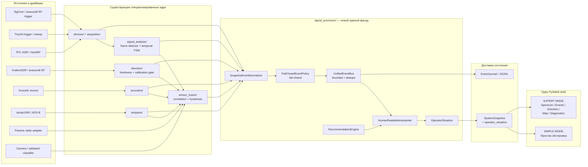
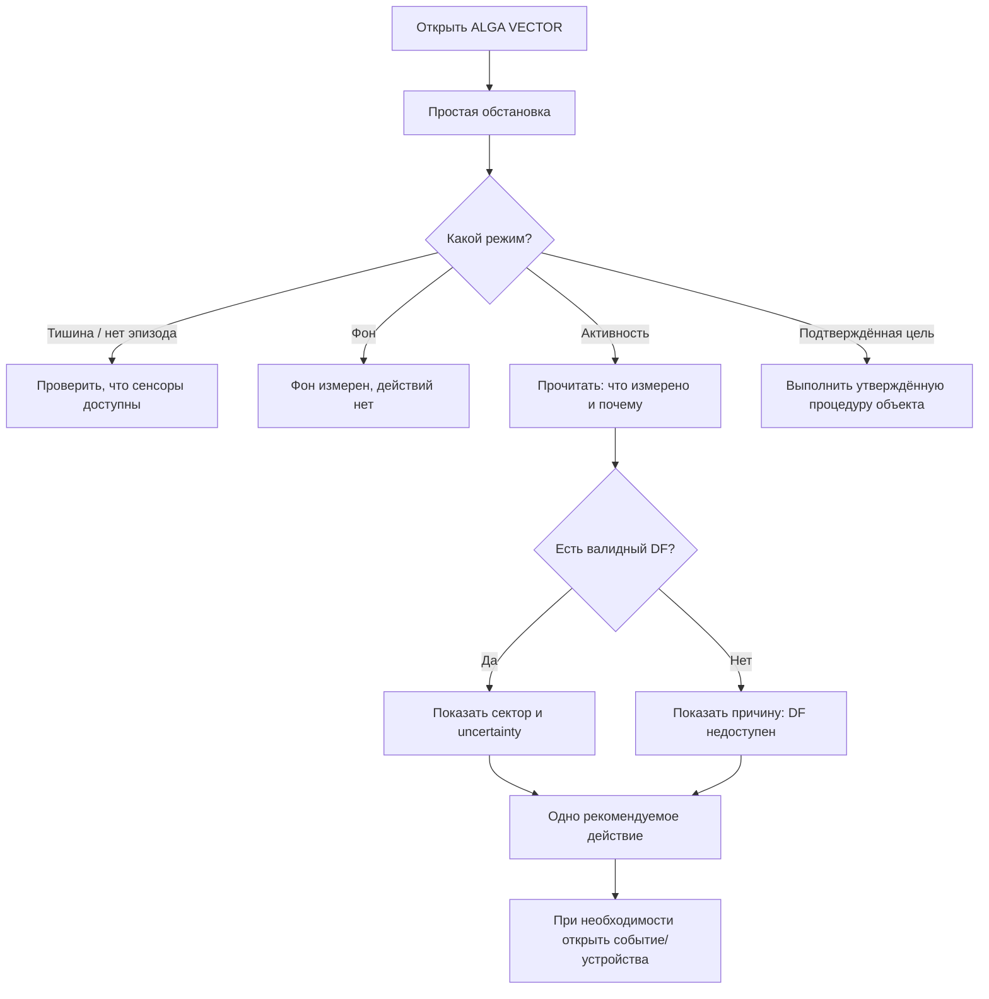

# ALGA VECTOR — единый backend, SIMPLE MODE и EXPERT MODE

Дата решения: 2026-07-26  
Статус: архитектурный контракт инкремента 0.7  
Продукт: **ALGA VECTOR**  
Подпись: **Разработал: Буйвол и Задира**

## Результат

ALGA VECTOR остаётся одним Windows-приложением и одним backend, но получает два
представления одного и того же проверенного состояния:

- **SIMPLE MODE** отвечает на пять операторских вопросов: есть ли активность,
  что измерено, в каком секторе источник, насколько сильны признаки и что
  делать дальше;
- **EXPERT MODE** сохраняет спектр, waterfall, временные состояния, причины
  отказов, полную evidence chain, направление, карту, журнал и диагностику.

Новый пакет `signal_processor/` не дублирует существующие детекторы. Он является
стабильным фасадом между уже работающими RF/acoustic/ADS-B/direction/fusion
модулями и любым UI:

1. принимает результаты существующих специализированных ядер;
2. нормализует их в один versioned event contract;
3. применяет fail-closed policy;
4. публикует события в bounded event bus;
5. строит `OperatorSituation` с коротким русским объяснением и действием.

UI больше не определяет класс события из частоты, RSSI, текста драйвера или
сырого кадра. SIMPLE MODE читает только `snapshot.operator_situation`.

## Непереговорные границы достоверности

- Число `confidence.value` — **эвристическая сила признаков**, а не
  калиброванная вероятность физического класса.
- Одна частота или попадание в известный диапазон не доказывает, что источник —
  БПЛА, рация или видеоканал.
- `LIKELY_HANDHELD_RADIO`, `LIKELY_VIDEO_LINK` и `LIKELY_DRONE_SIGNATURE`
  разрешены только при наличии валидированного классификатора и трассируемых
  evidence; обычный спектральный эвристический pipeline выдаёт общий RF-класс.
- `TARGET_CONFIRMED` разрешён только после независимого подтверждения: оператором
  по разрешённому каналу, камерой/оптическим классификатором с валидированной
  моделью либо другим явно авторизованным внешним классификатором. Частота,
  уровень сигнала или один сенсор не подтверждают цель.
- Число RSSI/уровень спектра не преобразуется в расстояние. На экране нет
  «2,4 км», «приближается» или координаты источника без отдельного
  калиброванного метода измерения дальности.
- Азимут и сектор в live-режиме показываются только по свежему внешнему
  DF-наблюдению с валидной калибровкой. Ручной ввод маркируется как ввод
  оператора, demo — как симуляция; они не становятся измеренным пеленгом.
- Отсутствующий или устаревший сенсор не заменяется нулём. Возможность
  деградирует, причина становится видимой, а подтверждение требует больше
  данных.
- ADS-B — контекст кооперативного гражданского вещания, не IFF и не полная
  воздушная обстановка.

---

## 1. Новая модульная схема

### 1.1. Целевая схема



### 1.2. Почему драйверы не переносятся физически в `signal_processor/`

`TinySA`, `RTL-SDR`, `HackRF` и discovery/reconnect уже изолированы в
`devices/`; проверки KrakenSDR и внешнего пеленга уже принадлежат
`direction/`. Перемещение USB/serial I/O в новый пакет создало бы регрессию и
циклические зависимости.

«Объединение» реализуется через один входной контракт:

- драйвер отвечает за соединение и получение данных;
- специализированное ядро отвечает за измерительный алгоритм;
- `signal_processor/` отвечает за нормализацию, policy, публикацию и
  человекочитаемую ситуацию;
- UI не знает, каким конкретно драйвером получен результат.

Таким образом SigOver trigger, TinySA, RTL-SDR и KrakenSDR становятся единым
операторским pipeline без переписывания проверенных адаптеров.

### 1.3. Обязанности модулей

| Модуль | Единственная ответственность |
|---|---|
| `schema.py` | Immutable versioned contracts, enums и строгая валидация |
| `normalizer.py` | `SnapshotEventNormalizer`: текущий `SystemSnapshot` → `NormalizationResult` |
| `policy.py` | Запрет неподтверждённой identity attribution, направления и ложной точности |
| `bus.py` | Bounded publish/subscribe, дедупликация и изоляция ошибочного subscriber |
| `recommendations.py` | Детерминированное короткое действие по событию и отсутствующим возможностям |
| `interpretation.py` | Выбор главного события, режима обстановки и русского объяснения |
| `processor.py` | Один публичный фасад обработки для `ApplicationRuntime` |
| `ui/pages/simple_situation.py` | Только рендер `OperatorSituation`; никакой классификации |

### 1.4. Путь одного события

```mermaid
sequenceDiagram
    participant D as Device/adapter
    participant C as Existing analysis core
    participant N as SnapshotEventNormalizer
    participant P as Policy gate
    participant B as UnifiedEventBus
    participant I as Interpreter
    participant R as Runtime snapshot
    participant U as SimpleSituationPage

    D->>C: измеренный кадр/trigger/DF observation
    C->>C: quality + temporal smoothing + hysteresis
    C->>N: typed result
    N->>P: NormalizedEvent candidate
    alt identity/direction contract нарушен
        P-->>N: reject; structured integration failure
    else policy выполнена
        P->>B: publish(event)
    end
    B->>I: bounded recent events + sensor state
    I->>I: priority + expiry + recommendation
    I->>R: OperatorSituation
    R->>U: immutable snapshot
    U->>U: render only
```

---

## 2. Нормализованная event schema

### 2.1. Enum-контракты

```python
class NormalizedEventType(StrEnum):
    NOISE_BACKGROUND = "NOISE_BACKGROUND"
    RADIO_ACTIVITY_DETECTED = "RADIO_ACTIVITY_DETECTED"
    LIKELY_HANDHELD_RADIO = "LIKELY_HANDHELD_RADIO"
    LIKELY_VIDEO_LINK = "LIKELY_VIDEO_LINK"
    LIKELY_DRONE_SIGNATURE = "LIKELY_DRONE_SIGNATURE"
    ADSB_CONTACT = "ADSB_CONTACT"
    ACOUSTIC_ANOMALY = "ACOUSTIC_ANOMALY"
    DIRECTION_ESTIMATED = "DIRECTION_ESTIMATED"
    MULTISENSOR_CORRELATED = "MULTISENSOR_CORRELATED"
    TARGET_CONFIRMED = "TARGET_CONFIRMED"
    SENSOR_UNAVAILABLE = "SENSOR_UNAVAILABLE"


class EventSeverity(StrEnum):
    INFO = "info"
    NOTICE = "notice"
    WARNING = "warning"
    ALARM = "alarm"
    CRITICAL = "critical"


class SensorKind(StrEnum):
    RF_TRIGGER = "rf_trigger"
    RF_SPECTRUM = "rf_spectrum"
    DIRECTION_FINDER = "direction_finder"
    ACOUSTIC = "acoustic"
    ADSB = "adsb"
    PASSIVE_RADAR = "passive_radar"
    CAMERA = "camera"
    CLASSIFIER = "classifier"
    FUSION = "fusion"
    SYSTEM = "system"


class SensorAvailability(StrEnum):
    AVAILABLE = "available"
    DEGRADED = "degraded"
    UNAVAILABLE = "unavailable"
    STALE = "stale"


class ConfidenceBand(StrEnum):
    NOT_AVAILABLE = "not_available"
    LOW = "low"
    MEDIUM = "medium"
    HIGH = "high"


class OperatorSituationMode(StrEnum):
    SILENCE = "silence"
    BACKGROUND = "background"
    ACTIVITY = "activity"
    CONFIRMED_TARGET = "confirmed_target"
```

`SILENCE` означает отсутствие активного эпизода, а не автоматически «чистый
эфир». Текст «Фон чистый» допустим только в `BACKGROUND`, когда есть свежие
валидные измерения. Если сенсоры не дают данных, headline обязан сообщать
«Наблюдение ограничено» или «Данные недоступны».

### 2.2. `NormalizedEvent`

Production-контракт — frozen dataclass со следующими полями:

| Поле | Тип | Правило |
|---|---|---|
| `schema_version` | `str` | Непустая версия контракта, например `1.0`; читается явно |
| `event_id` | `str` | Непустой стабильный ID; не строится из UI-текста |
| `event_type` | `NormalizedEventType` | Только известный enum |
| `observed_at` | timezone-aware `datetime` | Время измерения |
| `received_at` | timezone-aware `datetime` | Время приёма; не раньше `observed_at` сверх допустимого clock policy |
| `severity` | `EventSeverity` | Важность для оператора, не «опасность объекта» |
| `confidence` | `ConfidenceScore` | Сила evidence, не вероятность |
| `summary_ru` | `str` | Одна короткая фраза |
| `explanation_ru` | `str` | Почему система так решила |
| `recommendation_ru` | `str` | Одно безопасное следующее действие |
| `sources` | `tuple[SourceAttribution, ...]` | Какие сенсоры внесли вклад |
| `evidence` | `tuple[EvidenceItem, ...]` | Supporting/contradicting/missing факты |
| `limitations` | `tuple[str, ...]` | Что текущие данные не доказывают |
| `frequency_hz` | `float | None` | Измеренная центральная/пиковая частота |
| `bandwidth_hz` | `float | None` | Измеренная занятая полоса |
| `direction` | `DirectionEstimate | None` | Только разрешённый policy угол/сектор |
| `episode_id` | `str | None` | Связь обновлений одного временного эпизода |
| `identity` | `ValidatedIdentityEvidence | None` | Только валидированная внешняя атрибуция |
| `tags` | `tuple[str, ...]` | Ограниченные машинные метки, не UI-разметка |
| `valid_until` | timezone-aware `datetime | None` | TTL high-consequence и временных событий |

Все строки и коллекции имеют upper bounds; numeric-поля конечны; временные поля
timezone-aware; объект immutable. Ошибка контракта не превращается в частичное
событие — создаётся `SENSOR_UNAVAILABLE`/incident на границе источника либо
кандидат отклоняется с structured reason code.

Пример безопасного события в диапазоне 5,8 ГГц:

```json
{
  "schema_version": "1.0",
  "event_id": "rf:rtl-sdr-01:episode-0042",
  "event_type": "RADIO_ACTIVITY_DETECTED",
  "observed_at": "2026-07-26T09:14:31.120+00:00",
  "received_at": "2026-07-26T09:14:31.180+00:00",
  "valid_until": "2026-07-26T09:14:36.120+00:00",
  "severity": "warning",
  "confidence": {
    "value": 0.72,
    "band": "medium",
    "basis_ru": "RF-эпизод устойчив в нескольких согласованных кадрах.",
    "is_calibrated_probability": false
  },
  "summary_ru": "Обнаружена активность в диапазоне 5,8 ГГц",
  "explanation_ru": "Наблюдается устойчивая пакетоподобная RF-форма; физический источник не установлен.",
  "recommendation_ru": "Подтвердите источник по разрешённой камере.",
  "sources": [
    {
      "sensor_id": "rtl-sdr-01",
      "sensor_kind": "rf_spectrum",
      "contribution": 0.72,
      "independent_confirmation": false,
      "explanation_ru": "Временной RF-эпизод прошёл hysteresis.",
      "observation_id": "episode-0042",
      "provenance": "live"
    }
  ],
  "evidence": [
    {
      "code": "RF.TEMPORAL_PERSISTENCE",
      "explanation_ru": "Активность повторилась в требуемом временном окне.",
      "source_id": "rtl-sdr-01",
      "measured": 4,
      "unit": "frames"
    }
  ],
  "limitations": [
    "Частота и форма спектра не устанавливают физический тип источника.",
    "Дальность не измеряется."
  ],
  "frequency_hz": 5800000000.0,
  "bandwidth_hz": 18000000.0,
  "direction": null,
  "episode_id": "episode-0042",
  "identity": null,
  "tags": ["packet_like", "generic_rf"]
}
```

Здесь намеренно нет `LIKELY_VIDEO_LINK`: диапазон и пакетоподобная форма сами по
себе недостаточны для такой атрибуции.

### 2.3. Confidence contract

```python
@dataclass(frozen=True, slots=True)
class ConfidenceScore:
    value: float | None          # 0..1 либо None, эвристическая сила evidence
    band: ConfidenceBand         # NOT_AVAILABLE / LOW / MEDIUM / HIGH
    basis_ru: str                # почему присвоена эта категория
    is_calibrated_probability: bool = False
```

Правила представления:

- SIMPLE MODE показывает `НИЗКАЯ / СРЕДНЯЯ / ВЫСОКАЯ` и краткое основание;
- EXPERT MODE может показать числовое `value`, но рядом всегда пишет
  «эвристическая сила признаков»;
- поле не форматируется как «87% вероятность БПЛА»;
- если появится реально калиброванная модель, она получает отдельный
  versioned contract с model card, dataset/version и calibration report.

### 2.4. Source attribution и доступность

Каждый вклад содержит как минимум:

```python
SourceAttribution(
    sensor_id="rtl-sdr-01",
    sensor_kind=SensorKind.RF_SPECTRUM,
    contribution=0.72,
    independent_confirmation=False,
    explanation_ru="Устойчивый RF-эпизод подтверждён во временном окне.",
    observation_id="rf-episode-0001",
    provenance="live",
)
```

`contribution` также не является вероятностью. Два логических результата из
одного и того же RF-потока не считаются двумя независимыми подтверждениями.
Независимость определяется provenance/source lineage.

Доступность не смешивается с вкладом и хранится в отдельном `SensorState`:

```python
SensorState(
    sensor_id="kraken-01",
    sensor_kind=SensorKind.DIRECTION_FINDER,
    availability=SensorAvailability.UNAVAILABLE,
    message_ru="Пеленгатор не подключён.",
    checked_at=now,
    capabilities=("bearing",),
)
```

Состояние отсутствующего сенсора также может публиковаться отдельным событием:

```json
{
  "event_type": "sensor_unavailable",
  "severity": "notice",
  "summary_ru": "Пеленгация недоступна",
  "explanation_ru": "KrakenSDR или другой валидированный DF-источник не подключён.",
  "recommendation_ru": "Продолжайте RF-наблюдение; для сектора подключите и откалибруйте DF.",
  "limitations": ["Азимут, сектор и положение источника не определены."]
}
```

### 2.5. Direction contract

`DirectionEstimate` хранит:

- `bearing_deg`;
- `uncertainty_deg` — половину ширины сектора;
- `source_id`;
- `observed_at` и `valid_until`;
- эвристическую `confidence` качества пеленга;
- `calibration_id`;
- обязательный `validated_external=True`.

SIMPLE MODE выводит, например, `Сектор 95–120°`, только если это следует из
валидного угла и uncertainty. При отсутствии подтверждённого DF вывод:
`Пеленгация недоступна: KrakenSDR не подключён`. Никакой псевдопеленгации по
RSSI, одной антенне или положению пика спектра нет.

Ручной и simulated bearing остаются в существующих expert-контрактах
`direction/`, но не могут быть сконструированы как `DirectionEstimate` для
операторского live-события.

### 2.6. Семантические gates типов событий

| Тип | Разрешённый источник | Что запрещено |
|---|---|---|
| `NOISE_BACKGROUND` | Свежая оценка фона с приемлемым quality | Выдавать при отсутствии данных |
| `RADIO_ACTIVITY_DETECTED` | Подтверждённый temporal RF episode | Приписывать физический тип |
| `LIKELY_HANDHELD_RADIO` | Валидированный classifier + evidence chain | Mapping `voice_like → рация` |
| `LIKELY_VIDEO_LINK` | Валидированный classifier/protocol evidence | Mapping «частота около 5.8 ГГц → видео» |
| `LIKELY_DRONE_SIGNATURE` | Версионированный независимый classifier | Любая частотная таблица как доказательство |
| `ADSB_CONTACT` | Свежий корректно разобранный cooperative broadcast | Считать IFF или полной обстановкой |
| `ACOUSTIC_ANOMALY` | Валидные PCM features + temporal persistence | Автоматически называть БПЛА |
| `DIRECTION_ESTIMATED` | Свежий live external DF + valid calibration | RSSI, manual или stale DF как измерение |
| `MULTISENSOR_CORRELATED` | Существующий fusion подтвердил временную корреляцию независимых модальностей | Считать корреляцию identity/`TARGET_CONFIRMED` |
| `TARGET_CONFIRMED` | Разрешённое независимое подтверждение/operator action | Один RF/acoustic/DF признак |
| `SENSOR_UNAVAILABLE` | Health/freshness/capability state | Молча скрывать потерю сенсора |

Built-in `SnapshotEventNormalizer` по определению строит из обычного RF или
acoustic результата только общий `RADIO_ACTIVITY_DETECTED` /
`ACOUSTIC_ANOMALY`. Он не пытается сначала создать identity-событие.

Внешний classifier передаёт уже нормализованное событие через
`UnifiedSignalProcessor.ingest()`. Если его identity contract неполон,
`NormalizedEvent` или `FailClosedEventPolicy` отклоняет интеграционную ошибку.
Автоматического тихого downgrade в processor нет: он скрыл бы дефект внешнего
адаптера. Adapter обязан явно сформировать generic event, если независимых
evidence недостаточно, и добавить limitation/reason code.

### 2.7. `OperatorSituation`

Это единственный сложный объект, который нужен экрану SIMPLE:

```python
@dataclass(frozen=True, slots=True)
class OperatorSituation:
    generated_at: datetime
    mode: OperatorSituationMode
    headline_ru: str
    explanation_ru: str
    severity: EventSeverity
    confidence: ConfidenceScore
    direction_ru: str
    direction: DirectionEstimate | None
    recommendation_ru: str
    primary_event: NormalizedEvent | None
    recent_events: tuple[NormalizedEvent, ...]
    sensors: tuple[SensorState, ...]
    limitations: tuple[str, ...]
```

`OperatorSituation` детерминирована входным snapshot и историей bounded bus.
Она не хранит QWidget, цвета, иконки или отформатированный HTML.

---

## 3. UX flow: SIMPLE MODE и EXPERT MODE

### 3.1. Общий переключатель

В header находится явный переключатель:

```text
[ ПРОСТОЙ ] [ ЭКСПЕРТНЫЙ ]
```

Переключение меняет только маршруты и плотность представления. Runtime,
драйверы, thresholds, текущий episode и журнал не перезапускаются. Выбранное
представление сохраняется через существующее поле:

- `SIMPLE MODE` ↔ `ui.experience_level: guided`;
- `EXPERT MODE` ↔ `ui.experience_level: expert`.

Это сохраняет обратную совместимость конфигурации и существующих тестов.

### 3.2. SIMPLE MODE

Стартовый маршрут: `simple_situation`.

Минимальная навигация:

- **Простая обстановка**;
- **Устройства** — guided подключение и один следующий шаг;
- **События** — только человекочитаемая лента;
- **Направление** — отдельная проверка DF без технического спектра;
- **Настройки** — базовые настройки и переключение режима.

Спектр, waterfall, карта, calibration metadata и технические таблицы скрыты из
основной навигации, но не удалены из продукта. Полный диагностический центр
сохранён в EXPERT MODE; критическая ошибка всё равно должна давать прямой
переход к диагностике.

Операторский цикл:



Крупные режимы:

| Mode | Пример headline | Условие |
|---|---|---|
| `SILENCE` | «Активных событий нет» | Нет живого episode; доступность сенсоров объяснена отдельно |
| `BACKGROUND` | «Фон чистый» | Есть свежие измерения и подтверждённый background |
| `ACTIVITY` | «Обнаружена RF-активность» | Есть нормализованное событие, но физический источник не подтверждён |
| `CONFIRMED_TARGET` | «Цель подтверждена» | Только policy-valid `TARGET_CONFIRMED` |

Для `ACTIVITY` допустима последовательность:

```text
Обнаружена активность в диапазоне 5,8 ГГц
Устойчивая пакетоподобная RF-форма наблюдается в нескольких кадрах.
Физический источник по одному спектру не установлен.
Сектор: 95–120° · внешний DF · данные свежие
Сила признаков: средняя
Действие: подтвердите источник по разрешённой камере.
```

Если DF отсутствует:

```text
Направление: недоступно
KrakenSDR или другой валидированный пеленгатор не подключён.
RF-наблюдение продолжается; расстояние и положение источника не определены.
```

Фильтр **«Показывать только важное»** скрывает:

- `INFO`;
- повторяющийся background;
- дублированные sensor availability updates без изменения состояния.

Он не скрывает:

- `WARNING`, `ALARM`, `CRITICAL`;
- потерю обязательного для текущего вывода сенсора;
- active/holding основного episode;
- `TARGET_CONFIRMED`;
- событие, из-за которого изменился главный статус.

### 3.3. EXPERT MODE

Стартовый маршрут можно оставить последним выбранным. «Простая обстановка»
остаётся доступной как summary, а навигация раскрывает:

- Обзор;
- Простая обстановка;
- Устройства;
- Спектр и waterfall;
- События и evidence chain;
- Направление;
- Карта;
- Диагностика;
- Настройки.

Expert видит:

- source IDs, timestamps, data age и provenance;
- frame/unit/calibration metadata;
- RF family, temporal lifecycle и episode ID;
- heuristic score с явной подписью, что это не probability;
- supporting, contradicting и missing evidence;
- contribution каждого сенсора и признак независимости;
- full sensor availability;
- exact bearing, uncertainty, freshness и calibration ID;
- structured reason codes и технический контекст incident.

Карта использует существующий `MapPage`. Она может показывать базу,
картографические измерения и разрешённый angular overlay, но не вычисляет
позицию RF-источника и не превращает сектор в точку без отдельной дальности.

### 3.4. Общие UX-правила

- Главное состояние всегда первое и самое крупное.
- На экране SIMPLE не больше одного primary action.
- Цвет кодирует состояние системы, а не предполагаемую «враждебность» объекта.
- Текст «уверенность» дополняется подписью «сила признаков».
- Нет процента вероятности класса в SIMPLE.
- Нет silent failure: runtime/UI read error создаёт fail-closed состояние.
- Demo/replay/live визуально различаются и не смешиваются.
- Состояние `holding` не выглядит как новое срабатывание.
- Повторный event с тем же episode/dedupe key обновляет карточку, а не создаёт
  звуковой шторм.

---

## 4. Обновлённый file tree

```text
src/alga_vector/
  application/
    runtime.py                  # lifecycle; вызывает UnifiedSignalProcessor
    multisensor.py              # существующая корреляция RF/acoustic/DF/ADS-B
    rf_scan.py
  devices/                      # TinySA, RTL-SDR, HackRF, discovery, reconnect
  signal_analysis/              # существующий RF detector + temporal FSM
  acoustics/                    # существующие features/temporal assessment
  airspace/                     # существующий local dump1090 context
  direction/                    # существующий валидированный angular input
  sensor_fusion/                # существующая консервативная корреляция
  signal_processor/             # НОВЫЙ UI-neutral facade
    __init__.py
    schema.py                   # NormalizedEvent, OperatorSituation, enums
    bus.py                      # UnifiedEventBus
    policy.py                   # identity/direction confirmation gates
    recommendations.py          # deterministic operator actions
    interpretation.py           # human-readable situation builder
    normalizer.py               # existing snapshot -> normalized events
    processor.py                # UnifiedSignalProcessor facade
  domain/
    models.py                   # SystemSnapshot + optional operator_situation
  storage/
    journal.py                  # versioned persistence / dual-write transition
  observability/
    jsonl.py                    # structured rejected-event/integration logs
  ui/
    main_window.py              # mode switch + mode-aware navigation
    pages/
      simple_situation.py       # НОВЫЙ основной operator screen
      dashboard.py              # expert overview
      devices.py
      spectrum.py               # expert technical surface
      events.py
      direction.py
      map.py                    # existing map, expert-only navigation
      diagnostics.py
      settings.py
    widgets/
      ...
tests/
  test_signal_processor_schema.py
  test_signal_processor_bus.py
  test_signal_processor_policy.py
  test_signal_processor_interpretation.py
  test_signal_processor_integration.py
  test_ui_simple_situation.py
  ...                           # существующий regression suite
docs/
  SIMPLE_EXPERT_ARCHITECTURE_RU.md
```

`operator_situation` добавляется в конец `SystemSnapshot` с безопасным default
`None`. Старые тестовые fixtures, adapters и external integrations продолжают
создавать snapshot без нового аргумента.

---

## 5. Экраны

### 5.1. «Простая обстановка»

Файл: `ui/pages/simple_situation.py`  
Класс: `SimpleSituationPage`  
Root object name: `simpleSituationPage`

Композиция сверху вниз:

1. `situationHeroCard` — крупный режим, headline и короткое объяснение;
2. строка из `directionCard`, `confidenceCard`, `recommendationCard`;
3. `sensorFallbackNotice` — только если capability отсутствует/degraded/stale;
4. `recentEventsCard` — короткая лента;
5. `importantOnlyCheckBox` — «Показывать только важное».

Hero имеет ровно четыре визуальных состояния:

- `QUIET` — активного episode нет, нейтральный графит;
- `BACKGROUND` — свежий измеренный фон, спокойный зелёный/teal;
- `ACTIVITY` — подтверждённая активность без физической identity, янтарный;
- `CONFIRMED` — только policy-valid confirmation, высокий контраст.

Карточка направления:

- показывает сектор только из `operator_situation.direction`;
- рядом указывает внешний источник и freshness;
- при `None` показывает причину, а не пустой компас;
- не содержит расстояние.

Карточка confidence:

- показывает qualitative band;
- выводит `basis_ru`;
- поясняет «эвристическая сила признаков, не вероятность класса».

Карточка действия:

- одно короткое действие;
- не предлагает подавление, наведение или автоматическую реакцию;
- при недостатке подтверждения ведёт к камере/устройствам/диагностике.

### 5.2. Expert Overview

Существующий `DashboardPage` остаётся технической сводкой. Он получает ссылку
на «Простую обстановку», но сохраняет:

- готовность;
- sensor contribution;
- инциденты;
- переходы в Spectrum/Events/Diagnostics.

Старый guided-блок постепенно заменяется `SimpleSituationPage`, после чего его
можно удалить отдельным cleanup-инкрементом, когда новая страница пройдёт
regression и usability checks.

### 5.3. Expert Spectrum

Существующий `SpectrumPage` не участвует в операторской классификации.
Он остаётся инструментом:

- настройки приёмника;
- live spectrum/waterfall;
- scan plan;
- exact frequency/bandwidth;
- quality flags;
- capture/replay.

Любое изменение tuning отражается в нормализованном sensor state; UI не
публикует `LIKELY_*` напрямую.

### 5.4. Events и explanation detail

В SIMPLE отображаются:

- время;
- человекочитаемый тип;
- диапазон/частота, если измерена;
- qualitative confidence;
- сектор либо причина его отсутствия;
- действие.

В EXPERT раскрываются:

- полный `NormalizedEvent`;
- origin/current schema version;
- episode/dedupe lineage;
- supporting/contradicting/missing evidence;
- sensor contributions;
- policy rejection/integration reason;
- limitations.

### 5.5. Devices и degraded state

Экран устройств показывает не только USB state, но и операторскую capability:

```text
RTL-SDR      ДАННЫЕ ЕСТЬ       RF-активность доступна
TinySA       НЕ ПОДКЛЮЧЁН      Trigger недоступен, RTL-SDR продолжает работу
KrakenSDR    НЕ ПОДКЛЮЧЁН      Сектор/азимут недоступен
ADS-B        УСТАРЕЛ           Гражданский контекст исключён из текущего решения
```

Отсутствие одного источника не блокирует весь экран и не меняет live на demo.

---

## 6. Production-grade code skeleton

### 6.1. Публичный фасад

UI и `ApplicationRuntime` зависят только от одного стабильного объекта:

```python
class UnifiedSignalProcessor:
    event_bus: UnifiedEventBus

    def __init__(
        self,
        *,
        event_bus: UnifiedEventBus | None = None,
        normalizer: SnapshotEventNormalizer | None = None,
        interpreter: HumanReadableInterpreter | None = None,
        recommendation_engine: RecommendationEngine | None = None,
        policy: FailClosedEventPolicy | None = None,
        history_limit: int = 64,
    ) -> None: ...

    def ingest(self, event: NormalizedEvent) -> PublishResult:
        """Вход для будущих уже нормализованных адаптеров/classifiers."""
        ...

    def process_snapshot(
        self,
        snapshot: SystemSnapshot,
        *,
        additional_events: tuple[NormalizedEvent, ...] = (),
        important_only: bool = False,
    ) -> OperatorSituation: ...

    def current_situation(
        self,
        *,
        now: datetime,
        important_only: bool = False,
    ) -> OperatorSituation: ...
```

Фактическая реализация может использовать другие внутренние имена, но публичные
свойства обязательны:

- детерминированный результат для одинакового snapshot/history;
- bounded memory;
- thread-safe read/publish;
- subscriber failure isolation;
- отсутствие raw IQ/NumPy arrays в `NormalizedEvent`;
- fail-closed identity и direction;
- явный provenance.

### 6.2. Event bus

`UnifiedEventBus`:

- хранит ограниченное количество последних событий;
- использует `RLock` или single-writer queue;
- дедуплицирует по стабильному event/episode transition key;
- не удерживает lock во время внешнего callback;
- изолирует исключение subscriber и пишет structured incident;
- выдаёт immutable tuple;
- не теряет `ALARM/CRITICAL` из-за фонового event flood;
- поддерживает `unsubscribe`;
- не выполняет UI-вызовы из acquisition thread.

Для Qt обновление всё равно происходит через существующий snapshot polling.
Event bus не эмитит сигнал непосредственно в QWidget и поэтому остаётся
UI-neutral и тестируемым.

### 6.3. Normalizer

Normalizer читает текущие контракты без изменения их семантики:

- `RfDecision`:
  `BACKGROUND → NOISE_BACKGROUND`, alertable generic family →
  `RADIO_ACTIVITY_DETECTED`;
- `AcousticAssessment`:
  устойчивый alertable episode → `ACOUSTIC_ANOMALY`;
- `CivilAirspaceSnapshot`:
  свежий parsed contact → `ADSB_CONTACT`;
- `DirectionSnapshot`:
  только fresh validated external measurement →
  `DIRECTION_ESTIMATED`;
- `FusionDecision`:
  корреляция остаётся generic activity и не превращается в identity;
- `DeviceSnapshot`/capabilities:
  absent/degraded/stale → `SENSOR_UNAVAILABLE`.

Существующие RF `voice_like`, `packet_like`, `carrier` и другие family
сохраняются в evidence/tags. Они не мапятся автоматически в «рация»,
«видеоканал» или «дрон».

### 6.4. Policy gate

Policy проверяет:

- lineage независимых источников;
- freshness;
- live/demo/replay provenance;
- calibration evidence для DF;
- classifier ID/version/model-card metadata для identity;
- разрешённый confirmation authority;
- отсутствие единственного частотного признака;
- отсутствие RSSI-derived range;
- минимальную полноту evidence/limitations.

Критический принцип built-in normalizer до конструирования identity event:

```python
if requested_event_type in IDENTITY_EVENT_TYPES and not validated_identity_evidence:
    return build_explicit_generic_activity(
        observation,
        limitation="Физический источник не подтверждён.",
        reason_code="POLICY.IDENTITY_EVIDENCE_REQUIRED",
    )
```

После этого `NormalizedEvent.__post_init__` и `FailClosedEventPolicy` повторно
проверяют контракт. Unsafe identity event невозможно даже временно положить в
bus. `TARGET_CONFIRMED` не создаётся как порог высокого heuristic score.

### 6.5. Recommendation engine

Recommendation engine — deterministic table/rules, а не генеративный текст.
Примеры:

| Состояние | Рекомендация |
|---|---|
| Background, все обязательные сенсоры доступны | «Действий не требуется. Продолжайте наблюдение.» |
| Generic RF activity, DF отсутствует | «Проверьте источник по разрешённой камере; для сектора подключите DF.» |
| Activity + valid sector | «Проверьте указанный сектор по разрешённой камере.» |
| Stale RF source | «Проверьте поток приёмника; старые данные исключены из решения.» |
| Sensor unavailable | «Откройте “Устройства” и восстановите указанный источник.» |
| Confirmed target | «Выполните утверждённую процедуру безопасности объекта.» |

Правило выбирает одно primary action и при необходимости несколько secondary
diagnostic hints, доступных в expert detail.

### 6.6. Runtime integration

Безопасная последовательность в `ApplicationRuntime.snapshot()`:

1. как сейчас собрать devices, capabilities, incidents, spectrum,
   RF/acoustic/airspace/direction/fusion;
2. создать базовый immutable `SystemSnapshot`;
3. передать его в `UnifiedSignalProcessor.process_snapshot`;
4. через `dataclasses.replace` добавить `operator_situation`;
5. сохранить итоговый snapshot в `_latest`;
6. journal/log failures нормализатора, но не скрывать базовый snapshot.

Если processor неожиданно упал, runtime:

- не возвращает предыдущую «нормальную» ситуацию как свежую;
- формирует fail-closed `OperatorSituation` с `SENSOR_UNAVAILABLE`;
- создаёт incident/reason code;
- сохраняет Expert pages доступными для диагностики.

### 6.7. UI contract

`SimpleSituationPage.refresh(snapshot)`:

```python
situation = attr(snapshot, "operator_situation")
if situation is None:
    render_fail_closed(
        headline="Обстановка пока недоступна",
        action="Проверьте запуск backend и откройте диагностику.",
    )
    return
render_mode(situation.mode)
render_direction(situation.direction_ru)
render_confidence(situation.confidence)
render_recommendation(situation.recommendation_ru)
render_recent(filter_events(situation.recent_events, important_only))
```

Страница не импортирует `RfFamily`, частотные таблицы, NumPy, драйверы или
`SensorFusionEngine`. Это архитектурно запрещает расхождение решений между UI.

---

## 7. Интеграция в текущий проект без переписывания с нуля

### Шаг 1. Зафиксировать регрессионный baseline

- сохранить текущий полный test result;
- добавить golden fixtures текущих `SystemSnapshot`;
- зафиксировать demo/live/safe provenance;
- не менять thresholds существующего RF/fusion ядра в этом инкременте.

Результат: можно доказать, что новый слой меняет представление, а не измерения.

### Шаг 2. Добавить `signal_processor/` как изолированный пакет

- создать schema, bus, policy, recommendations, interpreter и facade;
- покрыть unit-тестами validation, dedupe, bounded history и policy rejection;
- пока не подключать к MainWindow.

Результат: новый слой тестируется на сохранённых snapshot fixtures.

### Шаг 3. Адаптировать существующие результаты

- RF берётся из `snapshot.signal_decision`;
- acoustic — из `snapshot.acoustic`;
- direction — из `snapshot.direction`;
- ADS-B — из `snapshot.airspace`;
- correlation — из `snapshot.fusion_decision`;
- доступность — из `devices/capabilities/incidents`.

Ни один существующий детектор не удаляется и не меняет публичный контракт.

### Шаг 4. Расширить `SystemSnapshot`

Добавить опциональное поле `operator_situation` с default `None`. Затем
подключить processor в конце сборки snapshot через `replace`.

Результат: старые страницы и тестовые runtime продолжают работать; новая
страница получает единый объект.

### Шаг 5. Добавить «Простую обстановку»

- зарегистрировать `SimpleSituationPage`;
- сделать её стартовой для `guided/SIMPLE`;
- сохранить её доступной в EXPERT;
- добавить `importantOnlyCheckBox`;
- добавить fail-closed empty/error states;
- не удалять старые страницы.

### Шаг 6. Сделать mode-aware navigation

- SIMPLE скрывает raw spectrum/map/technical navigation;
- EXPERT показывает полный набор;
- смена mode не пересоздаёт runtime;
- текущий episode и история не теряются;
- `guided/expert` остаются значениями config для обратной совместимости.

### Шаг 7. Вернуть существующую карту в Expert navigation

`ui/pages/map.py` и map services уже существуют. Нужна только регистрация
`MapPage` в expert route list и regression тест границ:

- база/картографические измерения разрешены;
- manual bearing маркируется;
- RF-позиция не выводится;
- диапазон/расстояние из RSSI не вычисляется;
- отсутствие tile package не ломает operator list.

### Шаг 8. Перевести alerts и журнал на normalized event

Переход делать через dual-read/dual-write:

1. существующие RF decisions продолжают журналироваться;
2. рядом сохраняется `NormalizedEvent` с `schema_version`;
3. новый alert banner читает operator situation;
4. после периода совместимости старый UI-specific notification builder
   становится adapter, а не вторым решающим ядром.

Миграция журнала аддитивная; старые записи остаются читаемыми.

### Шаг 9. Подключать дополнительные источники

Каждый новый источник реализует две границы:

1. собственный validated adapter/analysis contract;
2. normalizer в `NormalizedEvent`/существующий `FusionObservation`.

Порядок:

- внешний acoustic source;
- локальный dump1090;
- KrakenSDR external DF;
- SigOver/TinySA trigger;
- passive radar observation;
- camera/authorized classifier.

Отсутствующий адаптер не требует изменений в `SimpleSituationPage`.

### Шаг 10. Production verification

Обязательные проверки:

- schema rejects naive/invalid times, NaN, пустые IDs и oversized payload;
- frequency-only input никогда не выдаёт `LIKELY_*` или `TARGET_CONFIRMED`;
- `voice_like` не становится автоматически «рацией»;
- 5.8 GHz не становится автоматически «видеоканалом»;
- высокий RF score не становится probability;
- RSSI не создаёт range;
- stale/manual/simulated DF не выдаётся как live measured sector;
- missing KrakenSDR даёт понятный fallback, остальная система работает;
- subscriber exception не останавливает acquisition;
- duplicate/holding updates не создают alert storm;
- SIMPLE не импортирует raw RF/domain classifier modules;
- EXPERT сохраняет spectrum, map, events и diagnostics;
- mode switch не перезапускает backend и не сбрасывает episode;
- runtime failure выглядит как failure, а не как «Фон чистый»;
- demo/replay/live всегда различимы;
- minimum window 1120×720 сохраняет headline, сектор, confidence и действие;
- клавиатурная навигация, focus order и screen-reader labels проверены;
- полный existing regression suite остаётся зелёным.

### Критерий готовности инкремента

Инкремент готов, когда оператор после запуска без чтения SDR-графиков видит:

1. текущее состояние;
2. измеренный тип активности без ложной identity;
3. сектор либо честную причину его отсутствия;
4. качественный уровень evidence;
5. одно рекомендуемое действие;
6. последние важные события;

а эксперт в том же процессе может открыть исходные технические доказательства,
не потеряв текущий episode и не запуская второй backend.
